Installation Guide for Windows
==============================

This guide is **only for Windows**.
If you need macOS, go [here](../mac-eng/).

Linux **is not** supported. If you needed Linux installation guide, please, contact us.

Follow the instructions even if you already have some of the software installed
(including `C:\Java-Training`). You will not lose any previous `Projects` because this folder is not being erased.
Although, you might want to backup `C:\Java-Training\Projects` to e.g. `Documents` folder temporarily.
All other files and subfolders of `C:\Java-Training` will either stay intact or will be overwritten by a newer version of the software.

<a id="detailni">Detail guide:</a>
-------------------------------------

If you are an experienced user, you can skip to the short [description](#kratky),
but we recommend to follow this version.

1.  Download the installation archive for later
    [Java-Training.7z](https://github.com/czechitas/java-install-dist/releases/download/2019-podzim/community/win/Java-Training.7z)

2.  Install **7-Zip**.

    Watch out: 7-Zip is better than **WinRAR** or **WinZip**.
    Install it even if you already have them.
    Especially we noticed **WinRAR** being unable to extract `.7z` correctly.
    We recommend avoid **WinRAR** and **WinZip** altogether and use exclusively **7-Zip** as it is free and open-source.

	

3.  Run the downloaded installator for 7-Zip.

4.  

5.  

6.  

7. If you are asked by Windows to permit admin changes, go ahead. (Yes/Ano)

    

8.  

9. 	

10. Run **7-Zip File Manager**.

    

11. Open app settings.

    

12.	Check whether you have 7-Zip associated with .7z a .zip. We recommend using it for all types of supported archives. (All types can be selected by the plus + button)

    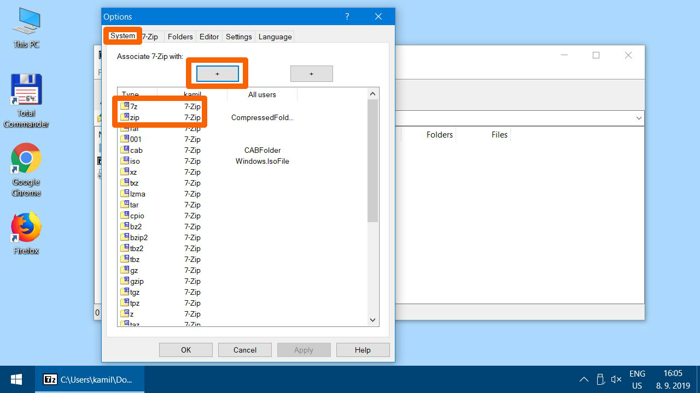

13.	A couple of convenient settings. Confirm by clicking OK and close all settings dialogs.

    

### The installation procedure itself

14. Find the downloaded `Java-Training.7z` (probably in
    `Downloads`), open using right click and choose 7-Zip -> Open archive

15. 

16. 

17. 

18. 

19. Extract the archive to `C:\Java-Training\`. This path is **mandatory**.
    It is necessary to have at least 3 GB free space on `C:` drive.
    If you don't have enough space, erase some redundant files.
    Good candidates are in the `Downloads` folder.

    

20. 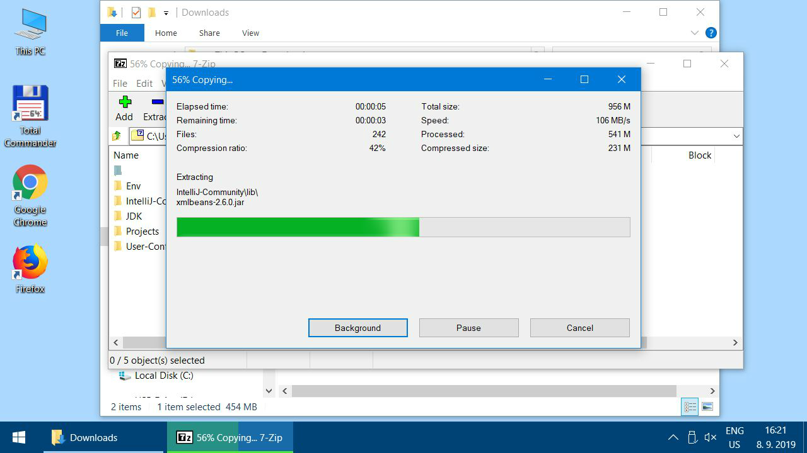

    Close 7-Zip after extraction.

21. Check that you have extracted archive correctly:
    You should have `C:\Java-Training\Projects\DemoApplication`
    on the `C:` drive after successful extraction.

    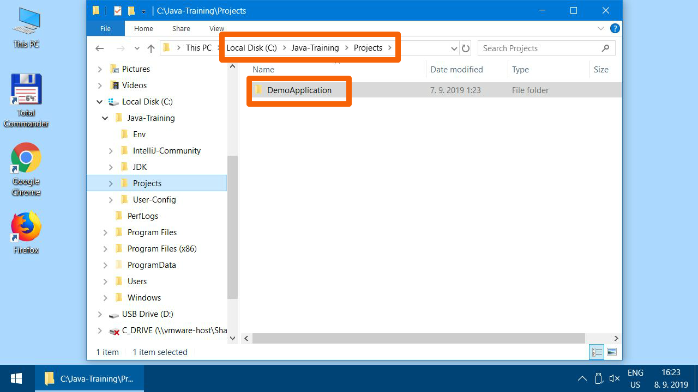

21. There is a shortcut to IntelliJ IDEA editor in `C:\Java-Training\IntelliJ-Community`. We recommend copying it to your desktop.

    

22. 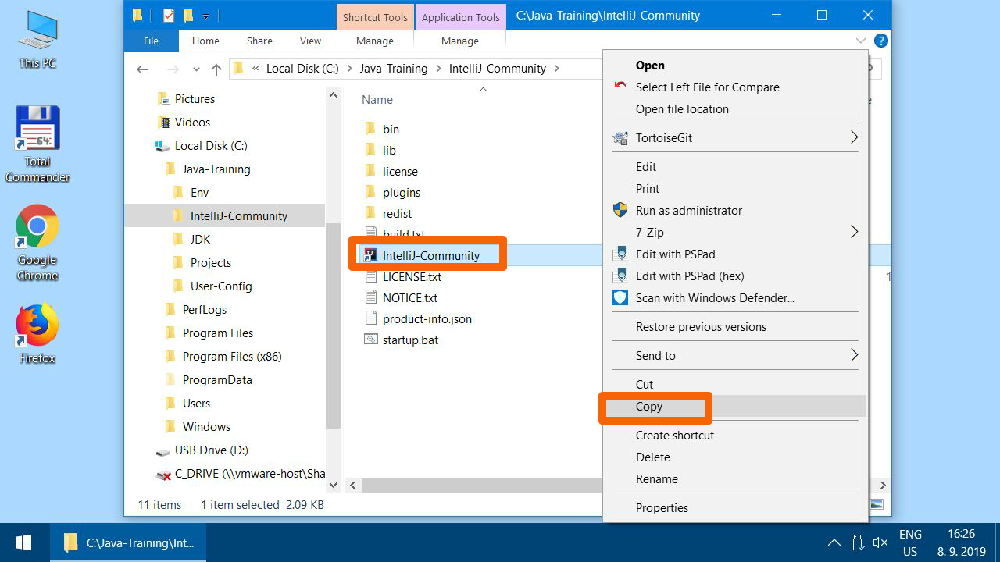

23. 

24. 

25. Run IntelliJ IDEA. (Be patient - the computer will look like it is "doing nothing" after double click, but the splash screen should appear shortly.)
    It is necessary to be connected to the internet at this point.

    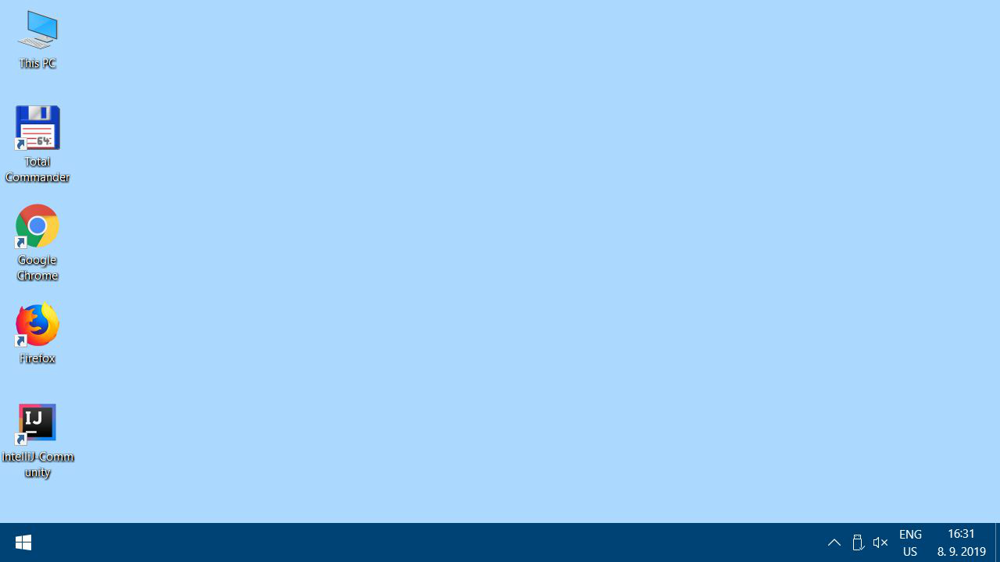

    

27. Open the demo project `C:\Java-Training\Projects\DemoApplication`.

    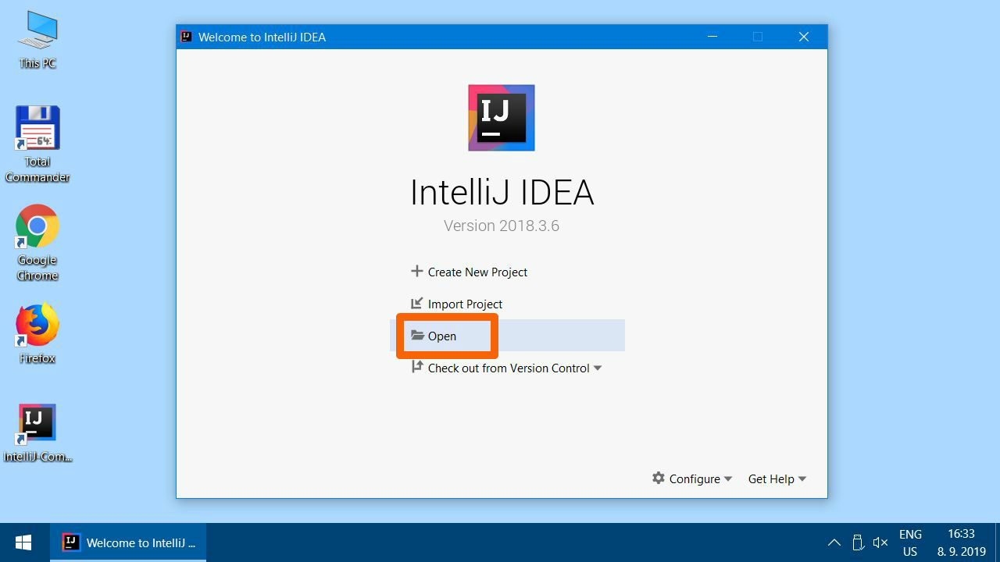

28. Watch out! Always expand the arrows in the open dialog
    **using single click only**
    to drill down to subfolder.
    **Never click twice** on the folder name.
    Sometimes it could be mistakenly understood by IntelliJ IDEA to import the entire double-clicked folder and not just expanding the folder.

    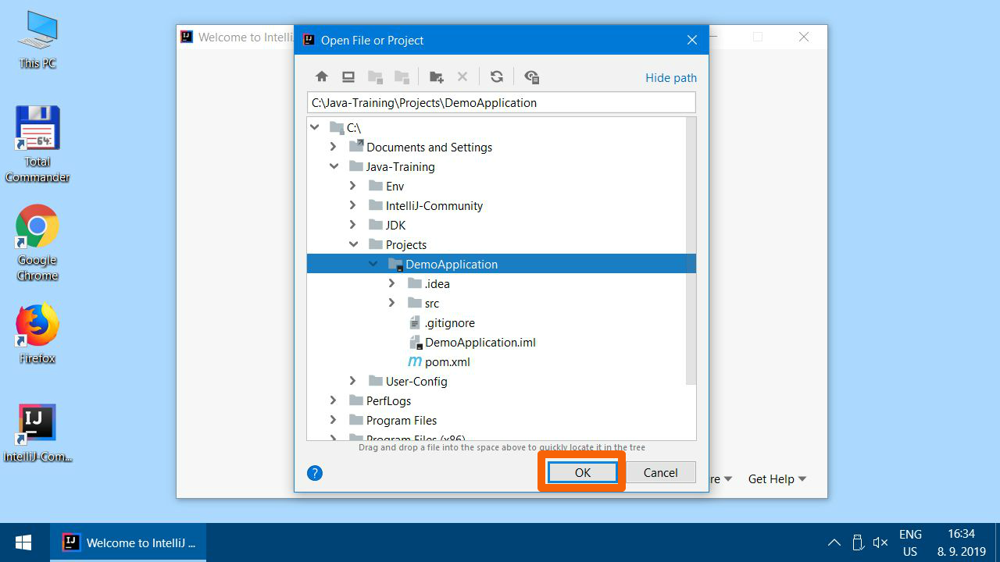

29. 

30. Wait for IntelliJ IDEA to index the entire Java runtime.
    When first run, it can take several minutes.
    It is necessary to still be connected to the internet.

    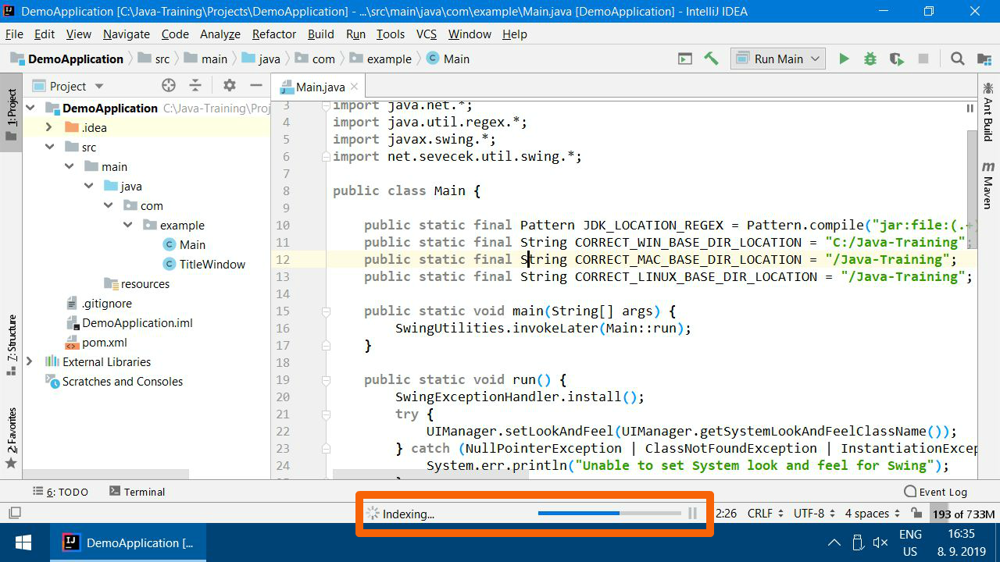

31. You should see `Main.java` in the open project. If not, expand the folders in the left panel (clicking on the arrows again) and double-click on the `Main.java`.

    

32. If IntelliJ IDEA is correctly set up, the source code in `Main.java`
    should be blue-violet as on the picture:

    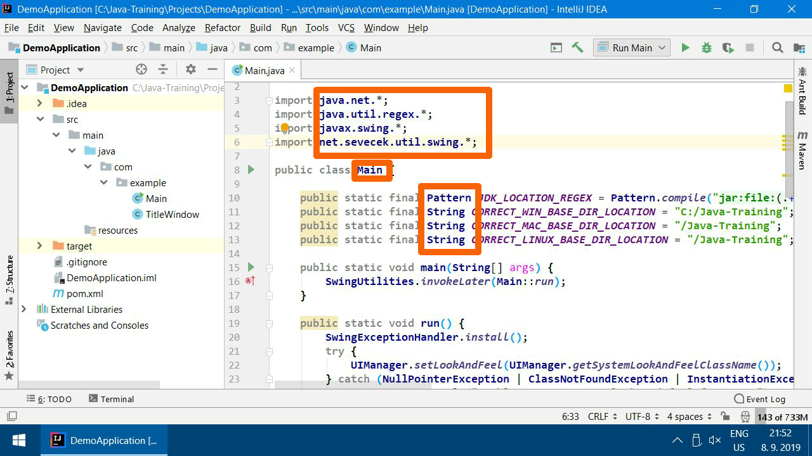

33. If you had a problem with internet connection, it would happen that you would see errors like bellow. If not, skip the corrective steps.

    

34. Corrective steps: When finally on the internet, open "Maven" tab.

    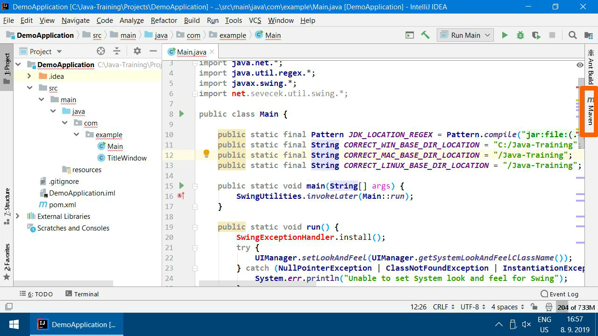

35. Click `Reimport All Maven Projects` button.

    

36. Still not fixed? Open Maven `Lifecycle`, choose `clean` and run the action. Watch out! It is a **different arrow then `Run Main`**!

    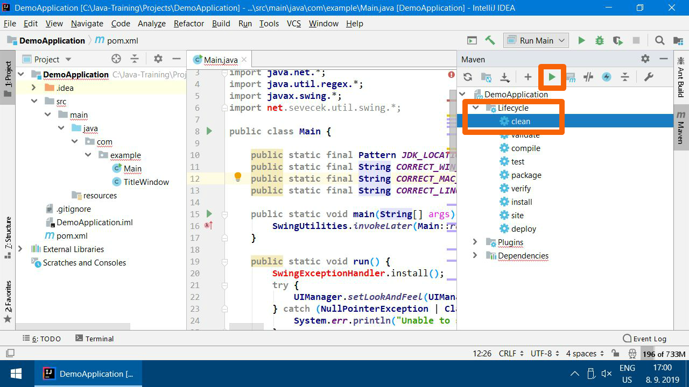

37. It it went OK, you will see `Process finished with exit code 0`

    

38. Follow on with `Package` goal.

    

39. Success:

    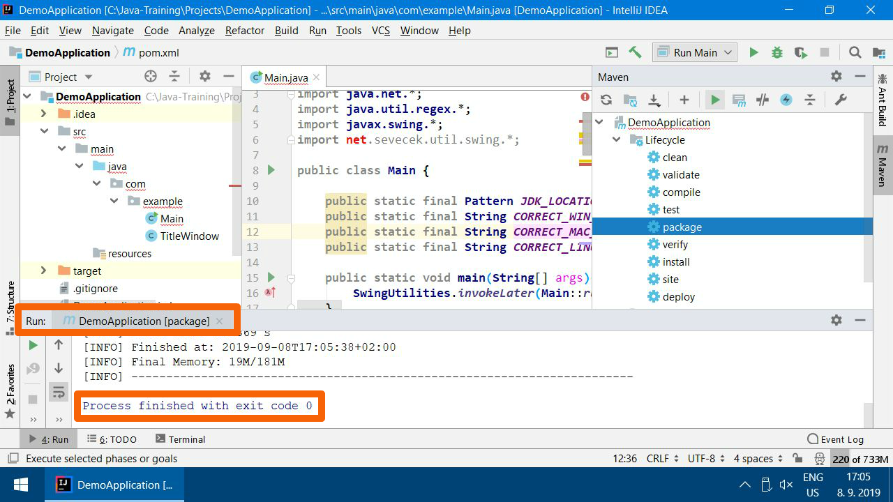

40. Repeat `Reimport All Maven Projects`.

    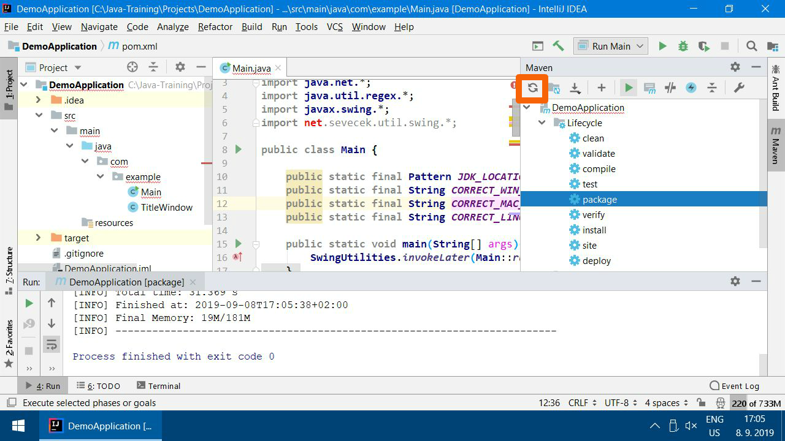

41. Look for `SwingExceptionHandler` not being red now.

    

42. Check the correct situation on 32. If it is OK, follow on.

    If not, try more heavy duty steps:
    - Close IntelliJ IDEA
    - Run `C:\Java-Training\Env\RunCmd.bat`
    - Write to the (black) command line (and confirm each line with `Enter`):
    - `cd ..\Projects\DemoApplication`
    - `mvn clean`
    - `mvn package`
    - Run IntelliJ IDEA again
    - Click `Reimport All Maven Projects` (as in step 28)
    - If it doesn't help, we will fix it at the workshop.

43. Run the application

    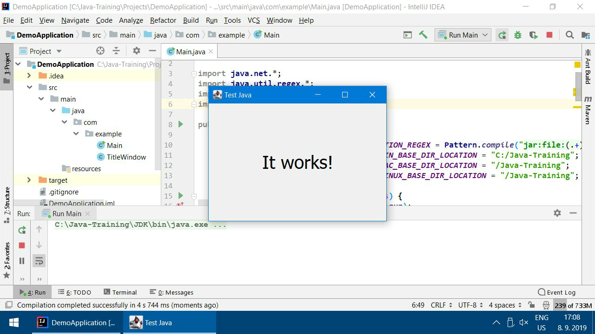

44. Everything should work now:

    

### Temporary files clean up

You can erase files from `Downloads` (`Java-Training.7z` and `7-Zipu` installer), to save some disk space.

### And that's it. We are looking forward to meet you at the workshop.

<a id="kratky">Short description (only for the experienced):</a>
------------------------------------------------------------
This guide is only for experienced people who know what they are doing.
We recommend going back up and follow the [detailed guide](#detailni).

The training course requires installation of Java (OpenJDK) and a programming editor IntelliJ IDEA (Community Edition).
**Do not install** it from the **offcial** distribution.
Use our preconfigured archive which you just extract to the fixed folder on the disk (`C:\Java-Training\`) and you are good to go.

Note: In fact, there is no serious installation going on. Files are just extracted to the fixed folder. It is a kind of a *portable distribution*.

Note: If you already have our own JDK or other included software installed on your computer,
it is not a problem but it will not be used for the training course. It is absolutely necessary to use the piece of software from our installation package
as it is all preconfigured. Our examples would not work without the special configuration.

1.  Download [Java-Training.7z](https://github.com/czechitas/java-install-dist/releases/download/2019-podzim/community/win/Java-Training.7z).

2.  If you do not have **7-Zip**, download and install it.

    Warning! Do not use **WinRAR** or **WinZip**, because they cannot extract `.7z` correctly.
    In general we recommend to uninstall **WinRAR** and **WinZip** completely as you must pay for their license.
    We consider it pointless when there is the free and open-source 7-Zip.
3.  Run 7zFM.exe (7-Zip File Manager) and open `Java-Training.7z` in it.
    Extract the archive to `C:\Java-Training`.

    Check that you extracted it correctly:
    You should have
    `C:\Java-Training\Projects\DemoApplication`
    folder on your `C:` drive.

4.  Copy `IntelliJ-Community.lnk` from `C:\Java-Training\IntelliJ-Community`
    to your desktop (`C:\Users\YOUR_USERNAME\Desktop`) and possibly to your Start Menu
    (`C:\Users\YOUR_USERNAME\AppData\Roaming\Microsoft\Windows\Start Menu\Programs`)

5.  Run `IntelliJ-Community` using the shortcut from previous step
    or run `C:\Java-Training\IntelliJ-Community\startup.bat`.

6.  Open the demo project selecting the folder
    `C:\Java-Training\Projects\DemoApplication`.
    You must be connected to the internet.

7.  When you open the project, IntelliJ IDEA will start indexing JDK and libraries.
    It will take a couple of minutes.
    Progress is displayed on the bottom editor line.

8.  After the indexing finishes, `Main.java` will become mainly violet-blue.

    If it stayed mainly black-grey, you wouldn't have it extracted to the correct folder.
    It must be in `C:\Java-Training`. In such a case, close everything, move it to the correct location and run IntelliJ IDEA again.
    If it was red, follow on to the troubleshooting section of the detailed guide
    (point 33 in the detailed installation guide).

7.  If everyhing is successful, you can run the project using the green arrow on the right top bar.
    Project will open a window with `It works!` label.
