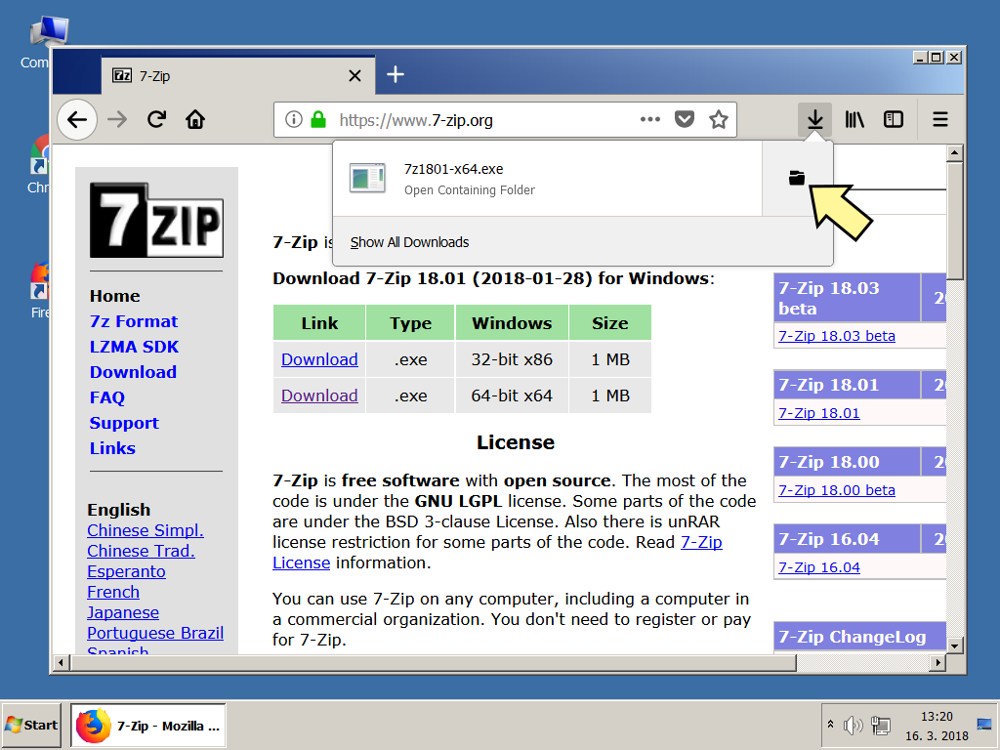
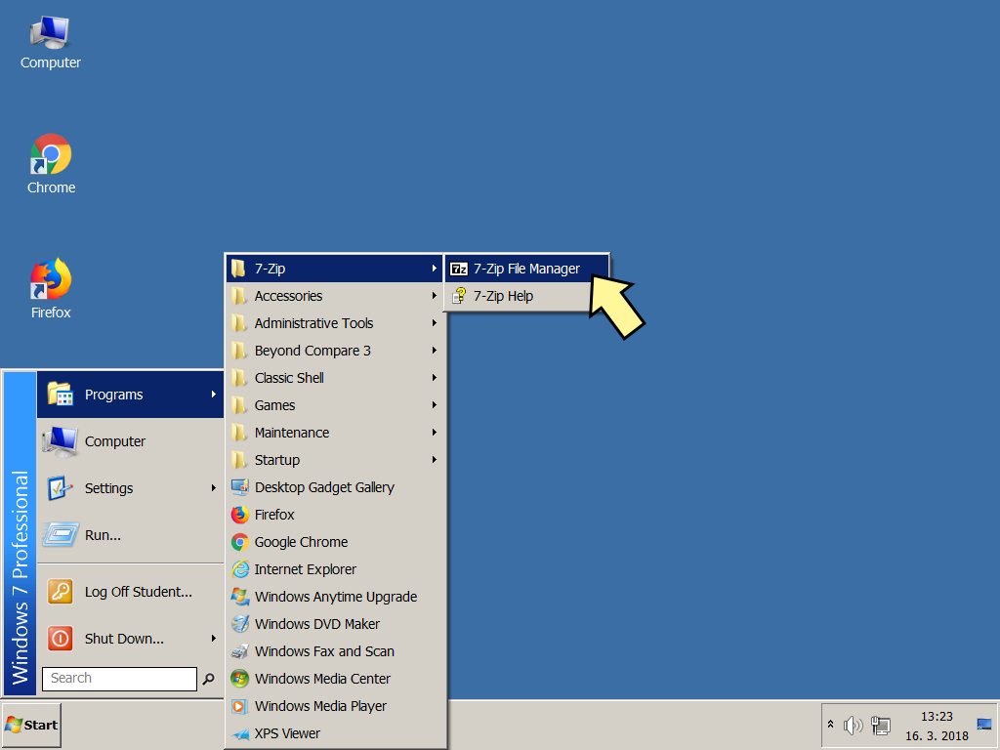
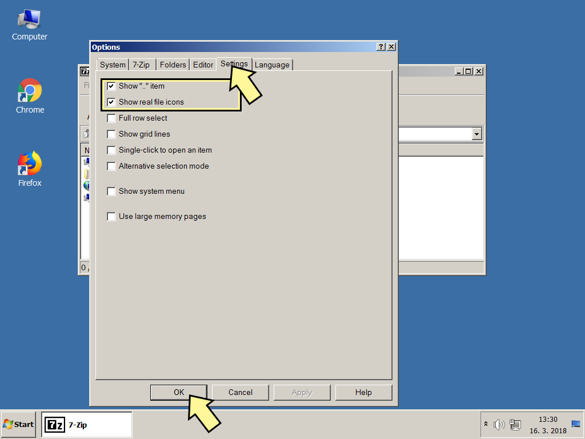
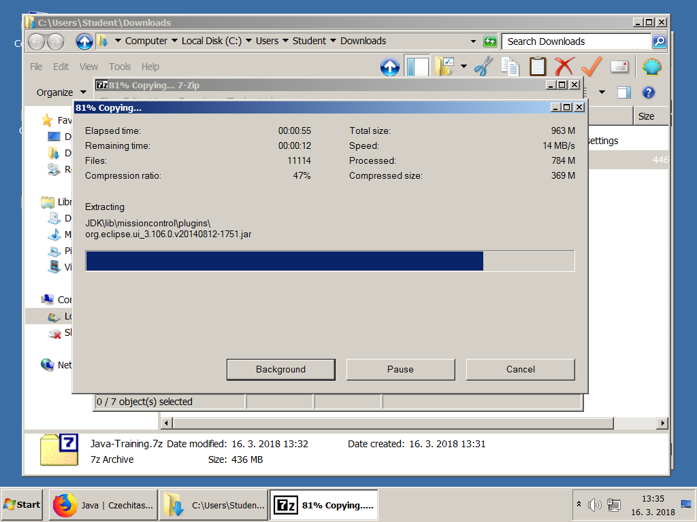
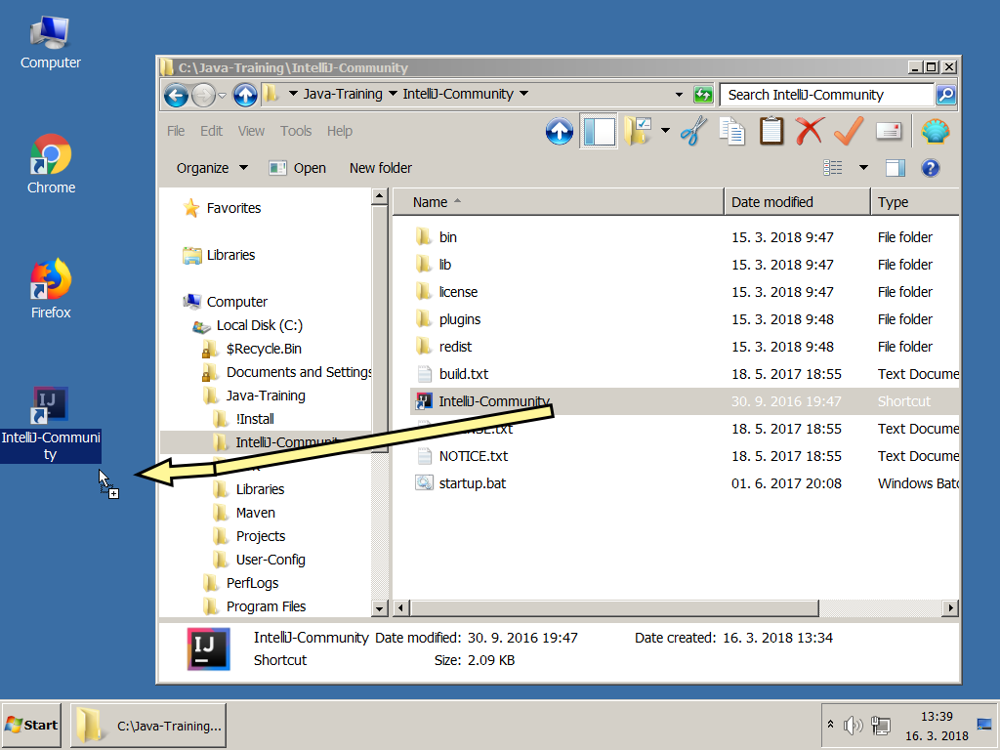
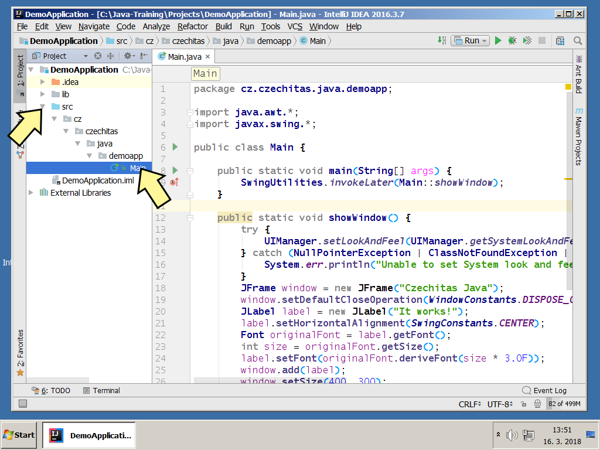
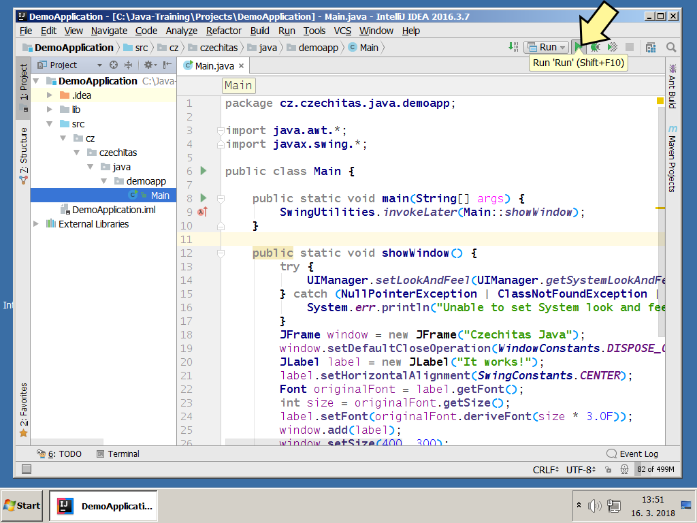
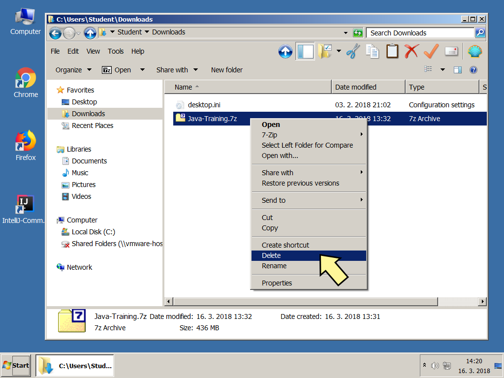

Instalační pokyny pro Windows
=============================

Tyto pokyny jsou **výhradně pro Windows**.
Instalaci pro macOS najdete [zde](../mac/).

Linux **není** podporován. Pokud byste potřebovali instalaci pro Linux,
byl by to problém, se kterým je nutno se ozvat lektorovi.

Tyto instrukce následujte i pokud už máte nějaké programy v
`C:\Java-Training` z minula. Žádný strach, původní projekty si tím nepřepíšete.
Ty máte v `C:\Java-Training\Projects` a tato složka se nemaže.
Složku `C:\Java-Training\Projects` si nicméně před touto instalací
můžete zazálohovat do jiné složky (např. `Dokumenty` ve svém uživatelském profilu).
Soubory v `C:\Java-Training` buď zůstanou nedotčeny
nebo budou přepsány novější verzí programů, což je v pořádku.

Pokud by kterýkoliv program,
který si stáhnete v archívu `Java-Training.7z`,
nabízel update, prosím, odmítněte to.
Programy jsou přesně vybrané, aby spolu fungovaly, a jsou předkonfigurované.
Updatované verze by ztratily konfiguraci a materiály z kurzu by nešly spustit.

Poznámka: **7-Zip** není součástí `Java-Training.7z` a můžete ho tedy updatovat dle libovůle.

<a id="detailni">Detailní postup:</a>
-------------------------------------

Zkušené uživatelky mohou přeskočit ke krátkému [popisu](#kratky),
ale doporučujeme to nedělat a držet se tohoto obrázkového návodu.

1.  Stáhněte si archív s instalací
    [Java-Training.7z](https://1drv.ms/f/s!AijQjx8qkEJYbKXo6btjwb98FSE)

1.  Nainstalujte si **7-Zip**.

    To platí i v případě, že už máte **WinRAR** nebo **WinZip**.
    Především **WinRAR** nedokáže soubory `.7z` správně rozbalit.
    Obecně doporučujeme **WinRAR** nebo **WinZip** úplně odinstalovat
    a používat výhradně **7-Zip**.
    Je zdarma, open-source a funguje výborně.

	

2. 	

3. 	

4. 	

5. 	

6. 	

7. 	

8. 	

9. 	Spusťte **7-Zip File Manager**. Spouštění se může lišit v závislosti
    na verzi Windows.

    

10. 

11. 

12. Asociujte si Z-Zip minimálně se soubory .7z a .zip, ale vřele doporučujeme používat ho na všechny archívy (tlačítko +)

    

13. Ještě pár nastavení pro přehlednější chování 7-Zipu.

    

### Samotný postup instalace

18. Na soubor `Java-Training.7z` ve složce
    `Downloads` klikněte pravým tlačítkem
    a vyberte 7-Zip -> Open archive

    

19. 

20. 

21. 

22. Archív vybalte do cesty `C:\Java-Training`. Tato cesta je **povinná**.
    Je nutné mít na disku `C:` alespoň 3 GB volného místa.
    Pokud byste neměly na disku dostatek místa, je nutné něco smazat.
    Dobrý kandidát jsou velké soubory ze složky `Downloads`.

    

23. Pro kontrolu, že jste archív rozbalily do správného umístění:
    Po rozbalení musíte mít na disku `C:` tuto složku
    `C:\Java-Training\Projects\DemoApplication`

    

24. 

25. 

26. 

27. Doporučujeme si přetáhnout na plochu zástupce pro spouštění IntelliJ IDEA.
    Při přetahování podržte Ctrl, zástupce se zkopíruje (místo přesunutí).

    

28. Spusťte IntelliJ IDEA

    

29. 

30. 

31. Otevřete ukázkový projekt `C:\Java-Training\Projects\DemoApplication`.

    

32. Pozor, v otevíracím dialogu rozklikávejte levé šipečky
    **pouze jedním kliknutím** 
    a vstupujte tak do podsložek.
    **Neklikejte** na jméno složky **2x**.
    IntelliJ IDEA to čas od času může špatně pochopit a pokusit se složku,
    ve které není javový projekt, importovat.

    

33. 

34. Počkejte, než IntelliJ IDEA po prvním spuštění naindexuje Javu.
    Může to trvat několik minut.

    

35. Rozklikněte složky v projektu a otevřete soubor Main.

    Správně nastavená IntelliJ IDEA obarvuje zdrojový text v Main.java
    do modrofialova stejně, jak je vidět v prostředku na obrázku:

    

36. Aplikaci spusťte a ověřte, že vše funguje správně.

    

37. 

### Úklid dočasných souborů
Po instalaci je nepovinně možno vymazat dočasné soubory, aby nezabíraly místo.

38. 

39. 

40. 

### A to je vše. Tešíme se na vás na akci.

<a id="kratky">Krátký popis (pouze pro zkušené):</a>
----------------------------------------------------
Tento popis je jen pro experty a dokumentuje slovně, co se provádí během instalace.
Doporučujeme tento popis nepoužít a postupovat podle obrázků [výše](#detailni).

Na kurzu budete potřebovat Javu (JDK) a programátorský editor IntelliJ IDEA (Community Edition).
**Neinstalujte** si je **ručně**, stáhněte si předpřiravený archív.

1.  Stáhněte si [Java-Training.7z](https://1drv.ms/f/s!AijQjx8qkEJYbKXo6btjwb98FSE).

2.  Pokud nemáte nainstalovaný **7-Zip**, nainstalujte si ho.

    Nepoužívejte **WinRAR** ani **WinZip**, protože ty nedokáží správně rozbalit archívy `.7z`.
    Obecně doporučujeme **WinRAR** nebo **WinZip** úplně odinstalovat
    a používat výhradně **7-Zip**.
    Je zdarma, open-source a funguje výborně.

3.  Vybalte `Java-Training.7z` do `C:\Java-Training`.

    Pro kontrolu, že jste archív rozbalili do správného umístění:
    Po rozbalení musíte mít na disku `C:` tuto složku
    `C:\Java-Training\Projects\DemoApplication`

3.  Ze složky `C:\Java-Training\IntelliJ-Community` si přetáhněte
    zástupce `IntelliJ-Community.lnk`
    na plochu nebo do nabídky Start.

8.  Zástupcem spusťte IntelliJ-Community a otevřete ukázkový projekt
    `C:\Java-Training\Projects\DemoApplication`.

9.  Po otevření se začne indexovat JDK, což bude pár minut trvat.

10. Až se to dokončí, zdrojový text v `Main.java` musí být převážně modrofialový.

    Pokud by byl naopak převážně černý, byl by to problém.
    Nejspíš byste totiž neměli archív vybalen ve správné složce
    `C:\Java-Training`.

11. Vpravo nahoře zezelená šipka pro spuštění ukázkového projektu, tak jej spusťte.
