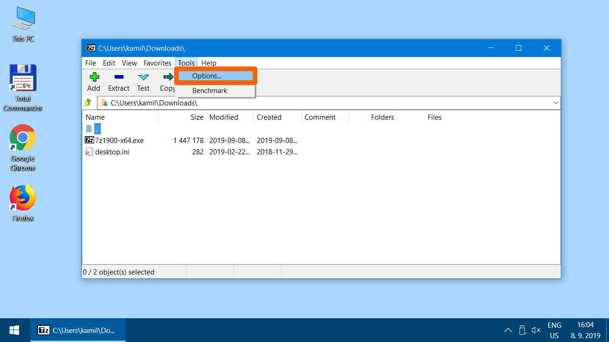
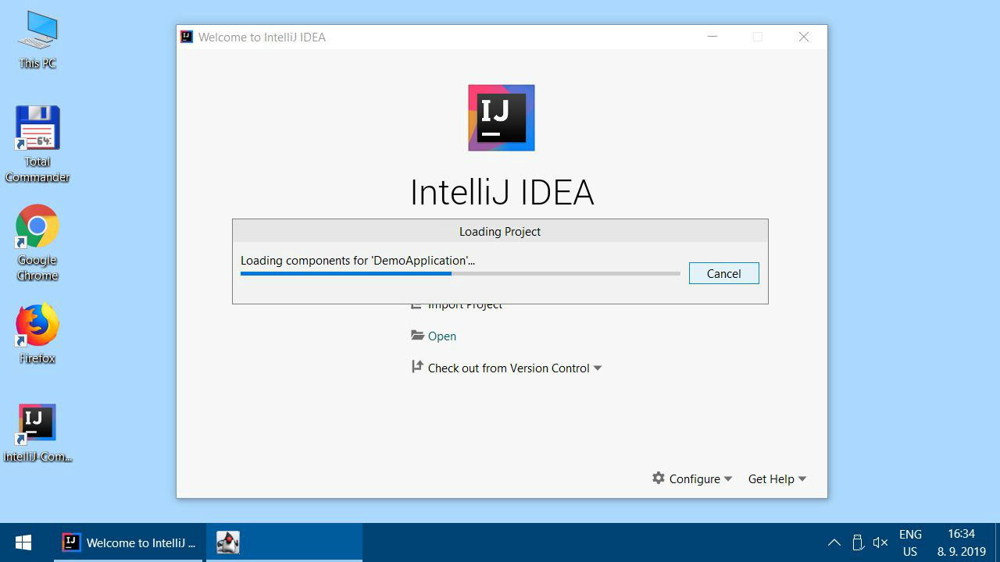

Instalační pokyny pro Windows
=============================

Tyto pokyny jsou **výhradně pro Windows**.
Instalaci pro macOS najdete [zde](../mac/).

Linux **není** podporován. Pokud byste potřebovali instalaci pro Linux,
byl by to problém, se kterým je nutno se ozvat lektorovi.

Tyto instrukce následujte i pokud už máte nějaké programy v
`C:\Java-Training` z minula. Žádný strach, původní projekty si tím nepřepíšete.
Ty máte v `C:\Java-Training\Projects` a tato složka se nemaže.
Složku `C:\Java-Training\Projects` si nicméně před touto instalací
můžete zazálohovat do jiné složky (např. `Dokumenty` ve svém uživatelském profilu).
Soubory v `C:\Java-Training` buď zůstanou nedotčeny
nebo budou přepsány novější verzí programů, což je v pořádku.

Pokud by kterýkoliv program,
který si stáhnete v archívu `Java-Training.7z`,
nabízel update, prosím, odmítněte to.
Programy jsou přesně vybrané, aby spolu fungovaly, a jsou předkonfigurované.
Updatované verze by ztratily konfiguraci a materiály z kurzu by nešly spustit.

Poznámka: **7-Zip** není součástí `Java-Training.7z` a můžete ho tedy updatovat dle libovůle.

<a id="detailni">Detailní postup:</a>
-------------------------------------

Zkušené uživatelky mohou přeskočit ke krátkému [popisu](#kratky),
ale doporučujeme to nedělat a držet se tohoto obrázkového návodu.

1.  Stáhněte si archív s instalací
    [Java-Training.7z](https://1drv.ms/u/s!AijQjx8qkEJYehKxsW0GobihutI?e=fL8aEN)

2.  Nainstalujte si **7-Zip**.

    To platí i v případě, že už máte **WinRAR** nebo **WinZip**.
    Především **WinRAR** nedokáže soubory `.7z` správně rozbalit.
    Obecně doporučujeme **WinRAR** nebo **WinZip** úplně odinstalovat
    a používat výhradně **7-Zip**.
    Je zdarma, open-source a funguje výborně.

	

3.  Stažený soubor - instalátor 7-Zipu - spusťte.

4.  

5.  

6.  

7. Pokud se Windows ptá, zda chcete aplikaci povolit provádět změny, dialog odsouhlaste. (Yes/Ano)

    

8.  

9. 	

10. Spusťte **7-Zip File Manager**. Spouštění se může lišit v závislosti
    na verzi Windows.

    

11.	Otevřete nastavení programu.

    

12.	Zkontrolujte, zda máte 7-Zip asociovaný minimálně se soubory .7z a .zip. Vřele doporučujeme používat ho na všechny archívy. (Všechny typy souborů označíte/odznačíte v dialogu tlačítkem plus +)

    

13.	Ještě pár nastavení pro přehlednější chování 7-Zipu. Na konci potvrďte změny tlačítkem OK. Všechna otevřená okna potom zavřete.

    

### Samotný postup instalace

14. Najděte na počítači uložený soubor `Java-Training.7z` (pravděpodobně je ve složce
    `Downloads`), klikněte pravým tlačítkem
    a vyberte 7-Zip -> Open archive

15. 

16. 

17. 

18. Tlačítkem "Extract" spusťte rozbalovací dialog.

    

19. Archív vybalte do cesty `C:\Java-Training`. Tato cesta je **povinná**.
    Je nutné mít na disku `C:` alespoň 3 GB volného místa.
    Pokud byste neměly na disku dostatek místa, je nutné něco smazat.
    Dobrý kandidát jsou velké soubory ze složky `Downloads`.

    

20.  

    Po rozbalení zavřete 7-Zip. 

21. Pro kontrolu, že jste archív rozbalily do správného umístění:
    Po rozbalení musíte mít na disku `C:` tuto složku
    `C:\Java-Training\Projects\DemoApplication`.

    

21. Ve složce IntelliJ-Community najdete zástupce pro spouštění editoru IntelliJ IDEA. Doporučujeme zkopírovat ho na plochu.

     

22. 

23. 

24. 

25. Spusťte IntelliJ IDEA. (Buďte trpěliví - je normální, že počítač nějakou dobu "nic nedělá", než naskočí úvodní obrazovka.)

    
  

26. 

27. Otevřete ukázkový projekt `C:\Java-Training\Projects\DemoApplication`.

    

28. Pozor, v otevíracím dialogu rozklikávejte levé šipečky
    **pouze jedním kliknutím** 
    a vstupujte tak do podsložek.
    **Neklikejte** na jméno složky **2x**.
    IntelliJ IDEA to čas od času může špatně pochopit a pokusit se složku,
    ve které není javový projekt, importovat.

    

29. 

30. Počkejte, než IntelliJ IDEA po prvním spuštění naindexuje Javu.
    Může to trvat několik minut.

    

31. V otevřeném projekty byste měli vidět soubor Main.java. Pokud ne, rozklikněte složky v projektu a dvojklikem na jméno souboru ho otevřete v editoru. 

    

32. Správně nastavená IntelliJ IDEA obarvuje zdrojový text v Main.java
    do modrofialova stejně, jak je vidět na obrázku:

    

33. Pokud máte v tenhle moment problém s internetovým připojením, může se přihodit, že se nestáhnou všechna potřebná data. V takovém případě budete mít části textu červené - jako na obrázku níže.

    

34. Náprava: otevřete záložku "Maven" na pravé straně obrazovky.

    

35. Stiskněte tlačítko se šipkami "Reimport All Maven Projects" a nechte počítač pracovat.

    

36. Nepomohlo a pořád jsou některé části textu červené? Rozklikněte v záložce Mavenu složku "Lifecycle", označte "clean" a spusťte akci zelenou šipkou. POZOR, nespleťte si tuhle šipku se stejně vyhlížející šipkou o něco výše vedle "Run Main"!

    

37. Pokud celý proces úspěšně proběhl, vypíše se vám dole v okně "Process finished with exit code 0" 

    

38. To samé, co s "clean, udělejte ještě pro "package".

    

39. Úspěšně skončeno:

    

40. Znovu zkuste "Reimport All Maven Projects".

    

41. Žádoucí výsledek: SwingExceptionHandler už není červeně.

    

42. Žádoucí výsledek je ukázán v kroku č. 32. Máte-li modrý a fialový text dle obrázku, můžete přejít k dalšímu kroku.

    Pokud přetrvává červený text, můžete zkusit ještě následující postup:
    - zavřete IntelliJ IDEA
    - spusťte soubor C:\Java-Training\Env\RunCmd.bat
    - do objevivší se příkazové řádky postupně napište (a na konci každé řádky stiskněte [Enter]) tyto tři příkazy:
    - `cd ..\Projects\DemoApplication`
    - `mvn clean`
    - `mvn package`
    - znovu zapněte IntelliJ IDEA
    - stiskněte tlačítko pro reimport projektu (viz krok č. 28)

43. Spusťte aplikaci klikem na zelenou šipku vpravo nahoře.

    

44. Pokud všechno funguje správně:

    

### Úklid dočasných souborů
Po instalaci je nepovinně možno vymazat dočasné soubory v Downloads (Java-Training a instalátor 7-Zipu), aby nezabíraly místo.

### A to je vše. Tešíme se na vás na akci.

<a id="kratky">Krátký popis (pouze pro zkušené):</a>
----------------------------------------------------
Tento popis je jen pro experty a dokumentuje slovně, co se provádí během instalace.
Doporučujeme tento popis nepoužít a postupovat podle obrázků [výše](#detailni).

Na kurzu budete potřebovat Javu (JDK) a programátorský editor IntelliJ IDEA (Community Edition).
**Neinstalujte** si je **ručně**, stáhněte si předpřiravený archív.

1.  Stáhněte si [Java-Training.7z](https://1drv.ms/u/s!AijQjx8qkEJYehKxsW0GobihutI?e=fL8aEN).

2.  Pokud nemáte nainstalovaný **7-Zip**, nainstalujte si ho.

    Nepoužívejte **WinRAR** ani **WinZip**, protože ty nedokáží správně rozbalit archívy `.7z`.
    Obecně doporučujeme **WinRAR** nebo **WinZip** úplně odinstalovat
    a používat výhradně **7-Zip**.
    Je zdarma, open-source a funguje výborně.

3.  Vybalte `Java-Training.7z` do `C:\Java-Training`.

    Pro kontrolu, že jste archív rozbalili do správného umístění:
    Po rozbalení musíte mít na disku `C:` tuto složku
    `C:\Java-Training\Projects\DemoApplication`

3.  Ze složky `C:\Java-Training\IntelliJ-Community` si přetáhněte
    zástupce `IntelliJ-Community.lnk`
    na plochu nebo do nabídky Start.

4.  Zástupcem spusťte IntelliJ-Community a otevřete ukázkový projekt
    `C:\Java-Training\Projects\DemoApplication`.

5.  Po otevření se začne indexovat JDK, což bude pár minut trvat.

6. Až se to dokončí, zdrojový text v `Main.java` musí být převážně modrofialový.

    Pokud by byl naopak převážně černý, byl by to problém.
    Nejspíš byste totiž neměli archív vybalen ve správné složce
    `C:\Java-Training`. Řešení - viz bod 33 a dále v popisu instalace.

7. Vpravo nahoře zezelená šipka pro spuštění ukázkového projektu, tak jej spusťte.
