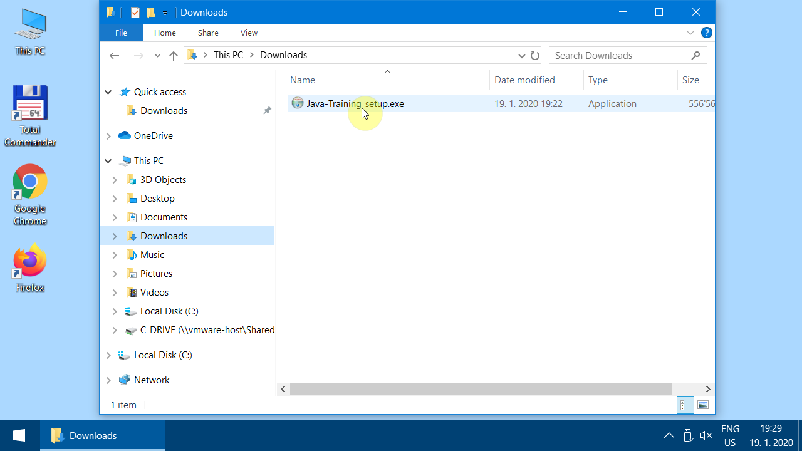
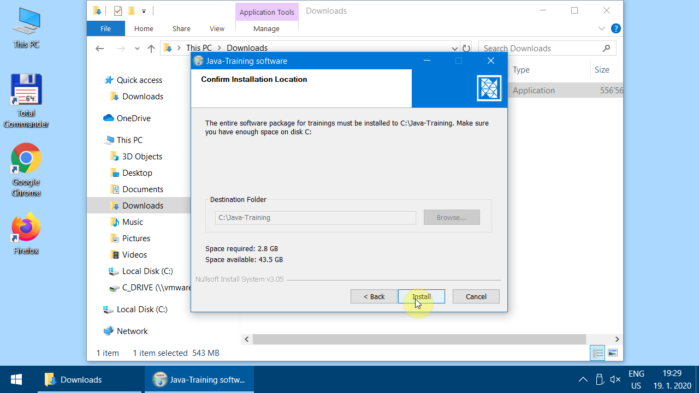
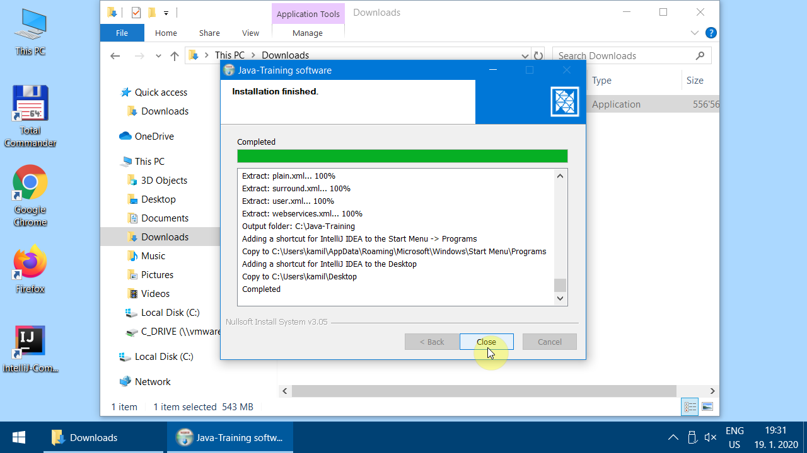
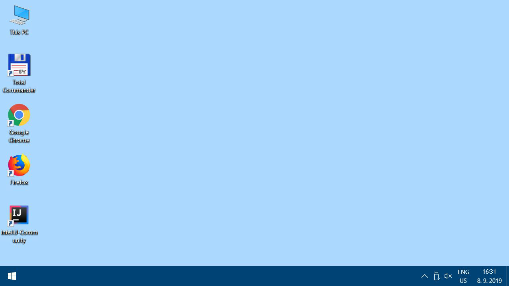
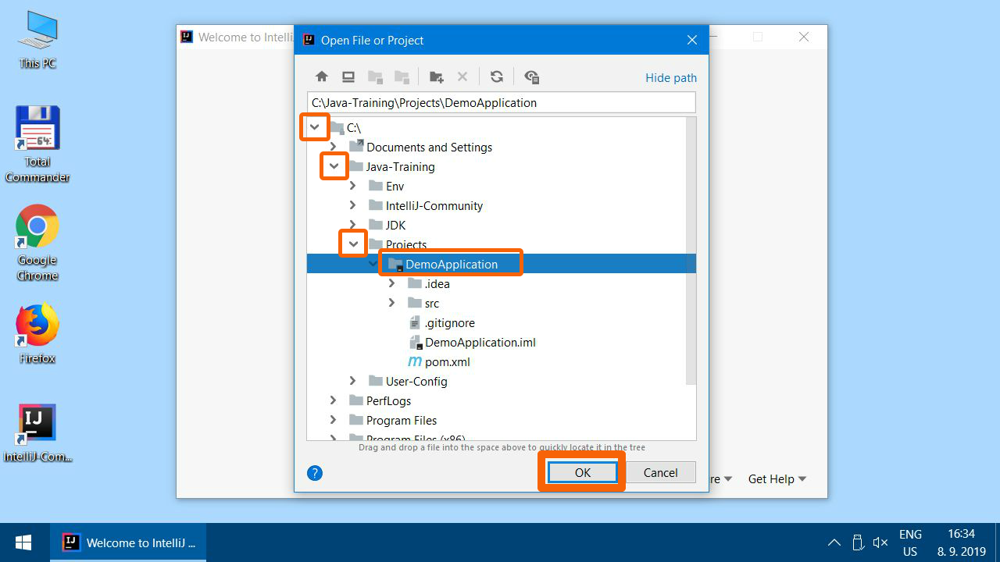
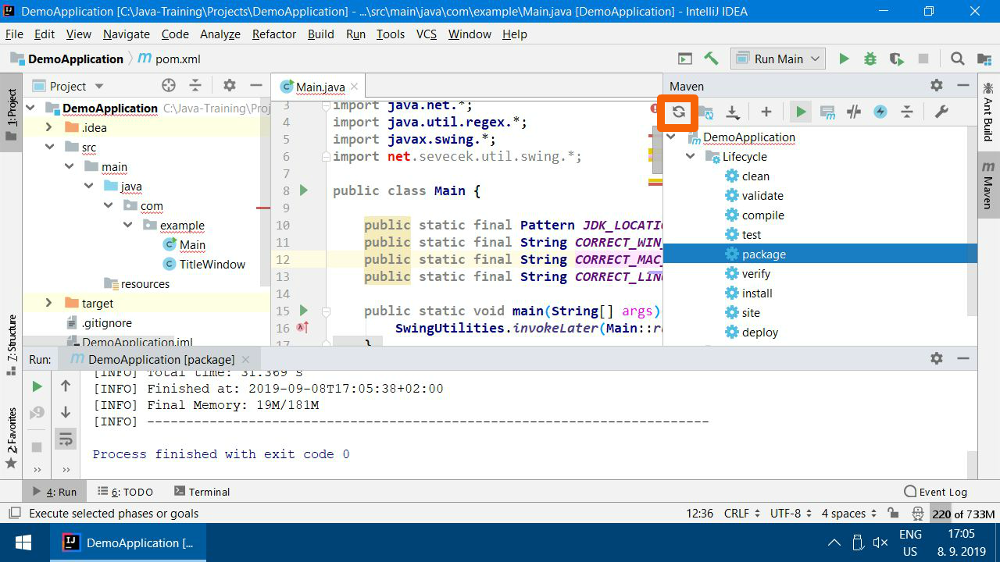

Instalační pokyny pro Windows
=============================

Tyto pokyny jsou **výhradně pro Windows**.
Instalaci pro macOS můžete vybrat [o složku výše](../).

Linux **není** podporován. Pokud byste potřebovali instalaci pro Linux,
bylo by nutno se dostatečně dopředu ozvat lektorovi.

Tyto instrukce následujte i pokud už máte nějaké programy v
`C:\Java-Training` z minula. Žádný strach, původní programy se jen aktualizují a vaše vlastní projekty zůstanou zachovány.
Projekty máte v `C:\Java-Training\Projects` a tato složka se nemaže.
Ostatní programy v `C:\Java-Training` buď zůstanou nedotčeny
nebo budou přepsány novější verzí programů, což je v pořádku.

Zkušení uživatelé mohou přeskočit ke [krátkému popisu](advanced.html),
ale doporučujeme to nedělat a držet se tohoto obrázkového návodu.

Detailní postup:
-----------------

1.  Nainstalujte si **7-Zip**.

    To platí i v případě, že už máte **WinRAR** nebo **WinZip**.
    Především **WinRAR** nedokáže soubory `.7z` správně rozbalit.
    Obecně doporučujeme **WinRAR** nebo **WinZip** úplně odinstalovat
    a používat výhradně **7-Zip**.
    Je zdarma, open-source a funguje výborně.

	

3.  Stažený soubor - instalátor 7-Zipu - spusťte.

4.  

5.  

6.  

7. Pokud se Windows ptá, zda chcete aplikaci povolit provádět změny, dialog odsouhlaste. (Yes/Ano)

    

8.  

9. 	

10. Spusťte **7-Zip File Manager**. Spouštění se může lišit v závislosti
    na verzi Windows.

    

11.	Otevřete nastavení programu.

    

12.	Zkontrolujte, zda máte 7-Zip asociovaný minimálně se soubory .7z a .zip. Vřele doporučujeme používat ho na všechny archívy. (Všechny typy souborů označíte/odznačíte v dialogu tlačítkem plus +)

    

13.	Ještě pár nastavení pro přehlednější chování 7-Zipu. Na konci potvrďte změny tlačítkem OK. Všechna otevřená okna potom zavřete.

    

### Samotný postup instalace

1.  Stáhněte si instalátor
    [Java-Training_setup.exe](https://github.com/czechitas/java-install/releases/download/2020-jaro/community/win/Java-Training_setup.exe)

2.  Najděte na počítači uložený soubor `Java-Training_setup.exe` (pravděpodobně je ve složce
    `Downloads`) a spusťte ho.

    

3.  Budete upozorněni, že instalátor není digitálně podepsán. To není problém. Schvalte výjimku.

    

4.  

5.  Pokud by nešlo výjimku pro instalátor schválit, přejďete na ruční [rozbalení archívu](alternative.html). Jinak pokračujte zde.

6.  

7.  

8.  

9.  

10. Instalace je hotová.

### <a id="test">Zkouška nainstalovaných programů</a>

1.  Spusťte IntelliJ IDEA. Buďte trpěliví - je normální, že počítač nějakou dobu *nic nedělá*, než naskočí úvodní obrazovka.
    Od tohoto bodu je nutné, abyste byli **připojení na internet**.

    

2.  

3.  Otevřete ukázkový projekt `C:\Java-Training\Projects\DemoApplication`.

    

4.  Pozor, v otevíracím dialogu rozklikávejte levé šipečky
    **pouze jedním kliknutím**
    a vstupujte tak do podsložek.
    **Neklikejte** na jméno složky **2x**.
    IntelliJ IDEA to čas od času může špatně pochopit a pokusit se složku,
    ve které není javový projekt, importovat.

    

5.  

6.  Počkejte, než IntelliJ IDEA po prvním spuštění naindexuje Javu.
    Může to trvat několik minut.

    

7.  V otevřeném projektu byste měli vidět soubor Main.java. Pokud ne, rozklikněte složky v projektu a dvojklikem na jméno souboru ho otevřete v editoru.

    

8.  Správně nastavená IntelliJ IDEA obarvuje zdrojový text v Main.java
    do modrofialova stejně, jak je vidět na obrázku:

    

9.  Pokud máte v tenhle moment problém s internetovým připojením, může se přihodit, že se nestáhnou všechna potřebná data. V takovém případě budete mít části textu červené - jako na obrázku níže.

    

10. Náprava: otevřete záložku "Maven" na pravé straně obrazovky.

    

11. Stiskněte tlačítko se šipkami "Reimport All Maven Projects" a nechte počítač pracovat.

    

12. Nepomohlo a pořád jsou některé části textu červené? Rozklikněte v záložce Mavenu složku "Lifecycle", označte "clean" a spusťte akci zelenou šipkou. POZOR, nespleťte si tuhle šipku se stejně vyhlížející šipkou o něco výše vedle "Run Main"!

    

13. Pokud celý proces úspěšně proběhl, vypíše se vám dole v okně "Process finished with exit code 0"

    

14. To samé, co s "clean, udělejte ještě pro "package".

    

15. Úspěšně skončeno:

    

16. Znovu zkuste "Reimport All Maven Projects".

    

17. Žádoucí výsledek: SwingExceptionHandler už není červeně.

    

18. Žádoucí výsledek je ukázán v kroku č. 17. Máte-li modrý a fialový text dle obrázku, můžete přejít k dalšímu kroku.

    Pokud přetrvává červený text, můžete zkusit ještě následující postup:
    - zavřete IntelliJ IDEA
    - spusťte soubor C:\Java-Training\Env\RunCmd.bat
    - do objevivší se příkazové řádky postupně napište (a na konci každé řádky stiskněte [Enter]) tyto tři příkazy:
    - `cd ..\Projects\DemoApplication`
    - `mvn clean`
    - `mvn package`
    - znovu zapněte IntelliJ IDEA
    - stiskněte tlačítko pro reimport projektu (viz krok č. 10)

19. Spusťte aplikaci klikem na zelenou šipku vpravo nahoře.

    

20. Pokud všechno funguje správně:

    

### Úklid dočasných souborů
Po instalaci je nepovinně možno vymazat dočasné soubory v Downloads (Java-Training a instalátor 7-Zipu), aby nezabíraly místo.

### A to je vše. Tešíme se na vás na akci.
