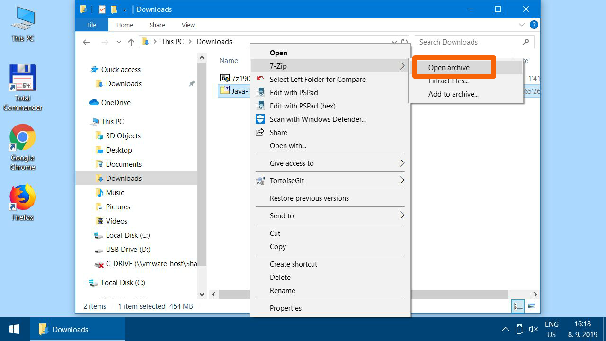
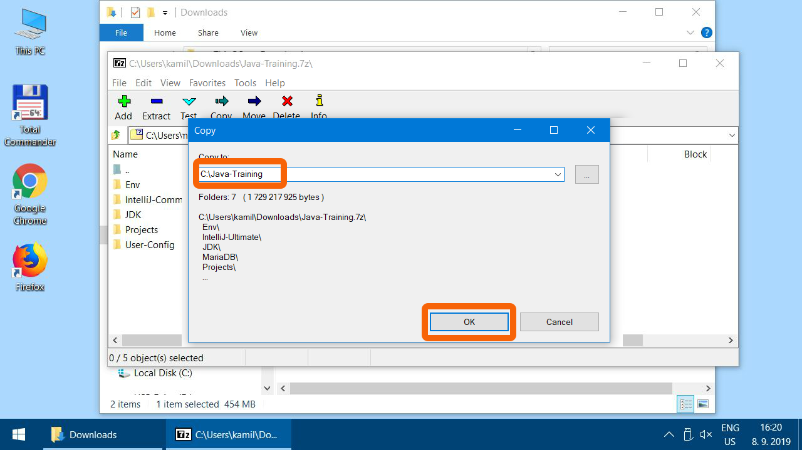
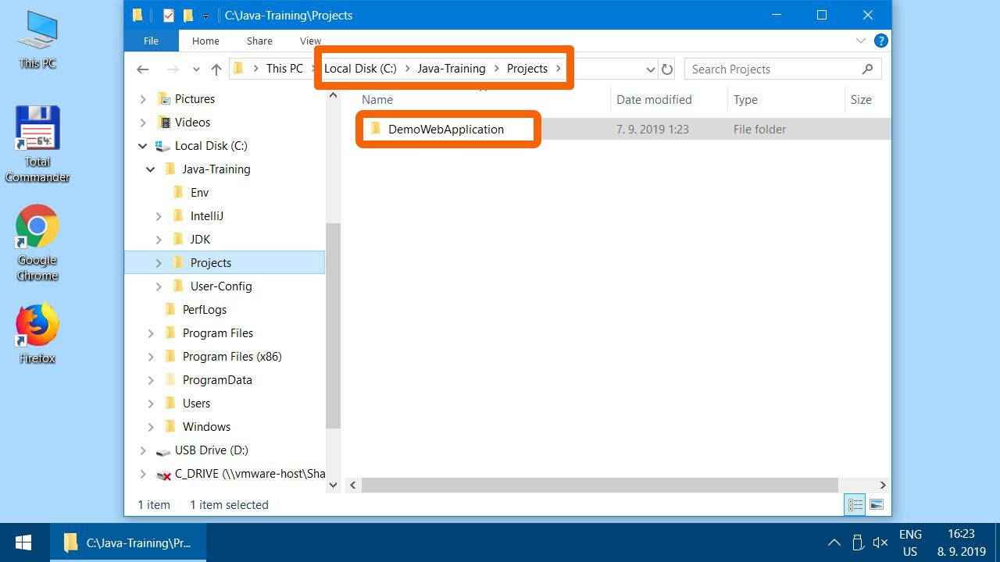
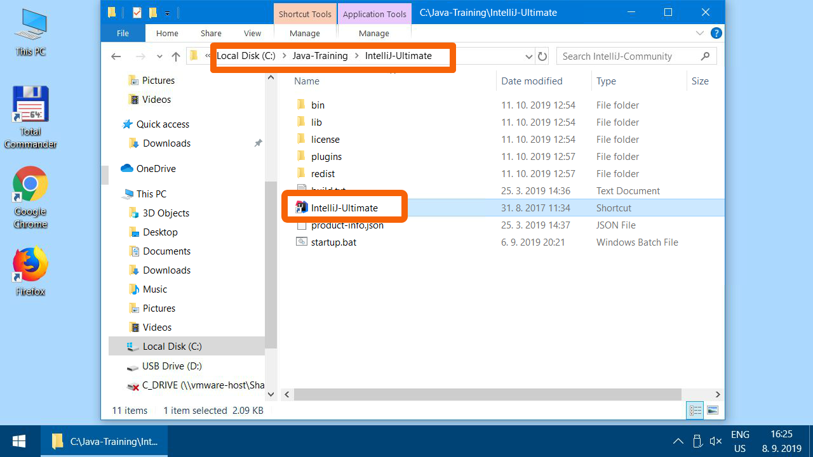
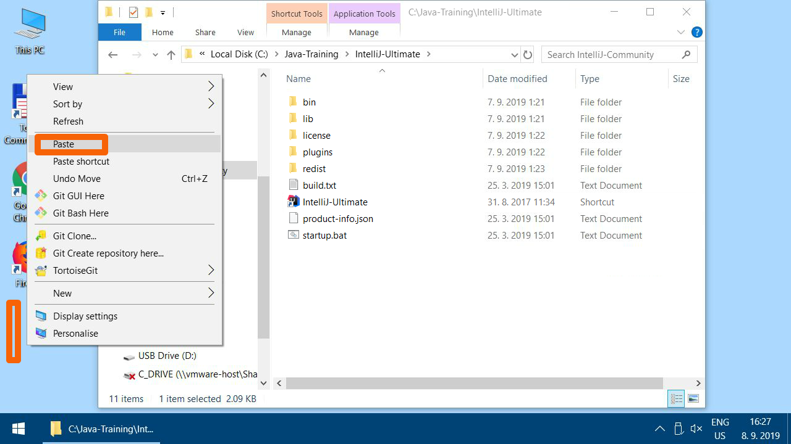
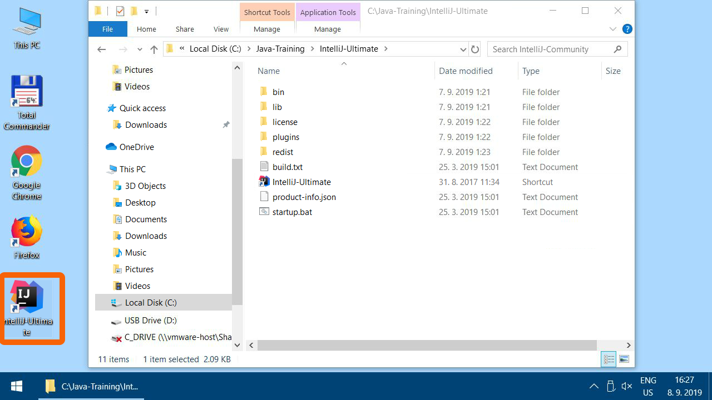

Alternativní postup místo instalátoru
-------------------------------------

V případě, že by vám instalátor `Java-Training_setup.exe` nešel spustit,
můžete použít manuální instalaci rozbalením archívu s programy.

1.  Download the installation archive
    [Java-Training.7z](https://github.com/czechitas/java-install-dist/releases/download/2020-jaro/ultimate/win/Java-Training.7z)

2.  Find the downloaded `Java-Training.7z` (probably in
    `Downloads`), open using right click and choose 7-Zip -> Open archive

3.  

4.  

5.  

6.  Click the "Extract" button.

    

19. Extract the archive to `C:\Java-Training\`. This path is **mandatory**.
    It is necessary to have at least 4 GB free space on `C:` drive.
    If you don't have enough space, erase some redundant files.
    Good candidates are in the `Downloads` folder.

    

8.  

    Close 7-Zip after extraction.

21. Check that you have extracted archive correctly:
    You should have `C:\Java-Training\Projects\DemoWebApplication`
    on the `C:` drive after successful extraction.

    

21. There is a shortcut to IntelliJ IDEA editor in `C:\Java-Training\IntelliJ-Ultimate`. We recommend copying it to your desktop.

    

11. 

12. 

13. 

14. Installation is finished.

Follow on to [test the installed software](index-eng.html#test).
