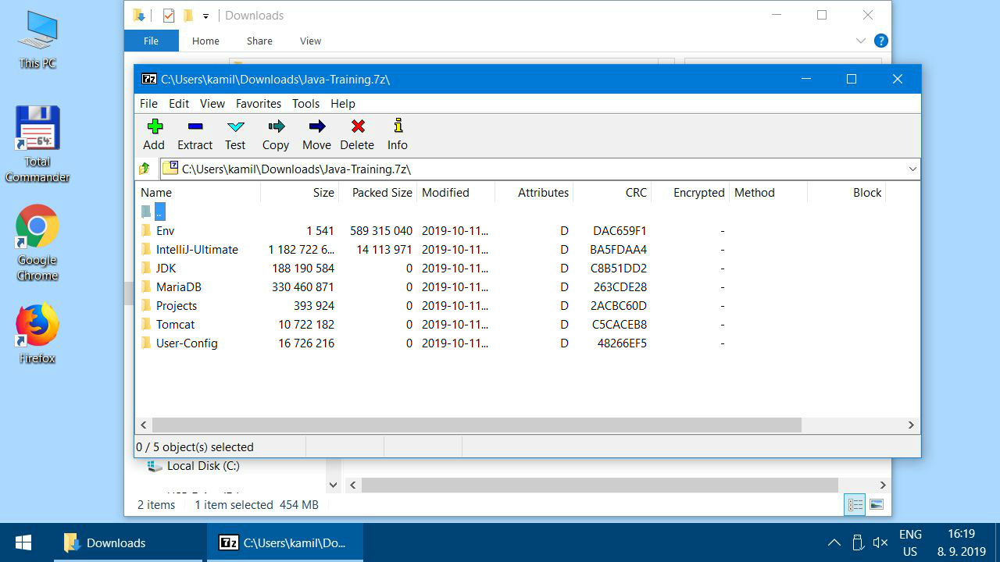
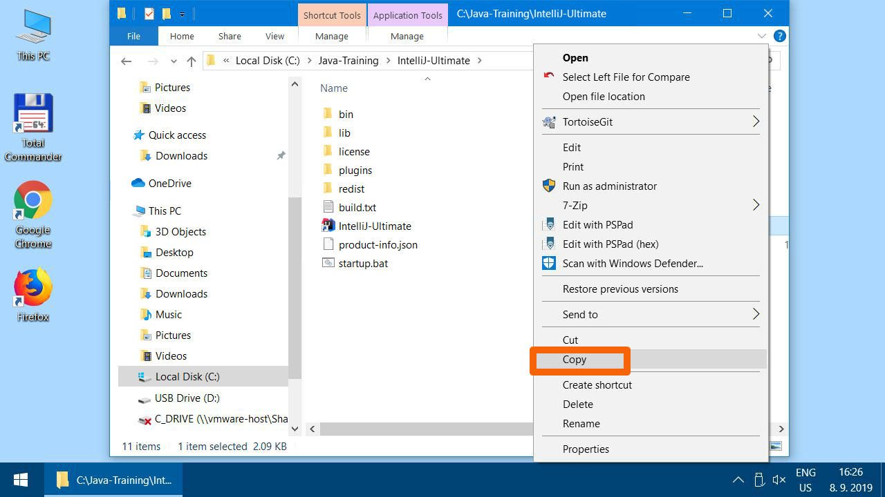

Alternativní postup místo instalátoru
-------------------------------------

V případě, že by vám instalátor `Java-Training_setup.exe` nešel spustit,
můžete použít manuální instalaci rozbalením archívu s programy.

1.  Stáhněte si archív s instalací
    [Java-Training.7z](https://github.com/czechitas/java-install-dist/releases/download/2020-jaro/ultimate/win/Java-Training.7z)

2.  Najděte na počítači uložený soubor `Java-Training.7z` (pravděpodobně je ve složce
    `Downloads`), klikněte pravým tlačítkem
    a vyberte 7-Zip -> Open archive

3.  

4.  

5.  

6.  Tlačítkem "Extract" spusťte rozbalovací dialog.

    

7.  Archív vybalte do cesty `C:\Java-Training\`. Tato cesta je **povinná**.
    Je nutné mít na disku `C:` alespoň 4 GB volného místa.
    Pokud byste neměly na disku dostatek místa, je nutné něco smazat.
    Dobrý kandidát jsou velké soubory ze složky `Downloads`.

    

8.  

    Po rozbalení zavřete 7-Zip.

9.  Pro kontrolu, že jste archív rozbalily do správného umístění:
    Po rozbalení musíte mít na disku `C:` tuto složku
    `C:\Java-Training\Projects\DemoWebApplication`.

    

10. Ve složce IntelliJ-Ultimate najdete zástupce pro spouštění editoru IntelliJ IDEA. Doporučujeme zkopírovat ho na plochu.

    

11. 

12. 

13. 

14. Instalace je hotová.

Pokračujte na [vyzkoušení nainstalovaných programů](index.html#test).

