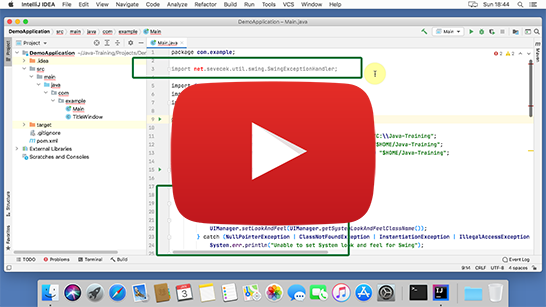

Instalační pokyny pro macOS
===========================

Tyto pokyny jsou **výhradně pro macOS**.
Instalaci pro Windows nebo Linux můžete vybrat [o složku výše](../).

Pokud už jste instalaci na Java kurz někdy prováděly,
nejspíš máte v `/Users/YOUR_USERNAME/Java-Training/Projects`
projekty z minula. Doporučujeme vám je zazálohovat zkopírováním například do `Documents` ve vašem uživatelském profilu
a po dokončení instalace je přesunout zpět do složky
`/Users/YOUR_USERNAME/Java-Training/Projects`.

Pokud by kterýkoliv program,
který si nainstalujete v rámci této instalace,
nabízel update, prosím odmítněte to.
Programy jsou přesně vybrané, aby spolu fungovaly, a jsou předkonfigurované.
Updatované verze by ztratily konfiguraci a materiály z kurzu by nešly spustit.

Instalace
---------

1. Stáhněte si instalátor javového prostředí a editoru:
   [Java-Training.zip](https://github.com/czechitas/java-install/releases/download/2022-jaro/community/mac/Java-Training.zip)

2. Držte se tohoto video návodu:

    

3. Vyzkoušejte otevřít a spustit Demo project:

    

### Úklid dočasných souborů

Po instalaci je nepovinně možno vymazat dočasné soubory v `Downloads` (`Java-Training`), aby nezabíraly místo.

    

### Troubleshooting

1.  Problém: Otevřela se složka `Downloads` (nebo kterákoliv jiná složka než `DemoApplication`) a vpravo chybí záložka `Maven`.

    

    Důvod: Nedodrželi jste správný postup práce s otevíracím dialogem a vybrali omylem špatnou složku.

    Řešení: V **IntelliJ IDEA** zvolte v menu **File** -> **Open...** a vyberte správnou složku.

2.  Problém: Maven build selhal nebo zdrojový text programu zůstal červený.

    

    Důvodů může být víc:
    - Nejste zrovna připojeni na internet.

      Řešení: Celou dobu instalace je nutné mít připojení k internetu. I během programování se vám to určitě bude hodit.
      Spusťte celou instalaci ještě jednou s připojením k internetu.

    - VPN (na firemním počítači).

      Důvod: V systému můžete mít nastaveno, že má **Maven** využívat vaši firemní repository knihoven, přístupnou přes VPN. Bylo by to napsané v konfiguraci v `/Users/YOUR_USERNAME/.m2/settings.xml`.

      Řešení: Překlad s **Mavenem** (`clean` a `package`) je třeba provádět s připojením na VPN. Raděj zůstaňte připojeni na VPN po celou dobu i při programování.

    - Předchozí body jsou vyřešeny, ale nepomohlo to. **IntelliJ IDEA** zobrazuje špatně barvy zdrojového textu.

      Řešení: Pokud přetrvává červený text i po opakovaném spuštění mavenových úkolů (`clean` a `package`), můžete zkusit ještě následující silnější kalibr:
        - Zavřete **IntelliJ IDEA**
        - Spusťte soubor `$HOME/Java-Training/Env/RunCmd.command` v terminálu (**Open with** -> **Terminal**)
        - Objeví se příkazová řádka. Postupně do ní napište tyto příkazy (a na konci každé řádky stiskněte [Enter]):
            - `cd $HOME/Java-Training/Projects/DemoApplication`
            - `mvn clean package exec:java`
        - Tentokrát by se už mělo zobrazit okno `It works`.
        - Znovu zapněte **IntelliJ IDEA**.
        - Stiskněte tlačítko pro Reimport projektu v záložce Mavenu.

        Více ve video návodu:

        

3. Maven build prošel bez problému, všechno v souboru `Main.java` je obarvené modře / fialově,
   obzvlášť řádek 3 v zeleném rámečku `import net.sevecek.util.SwingExceptionHandler;`
   je modrý (a nehlásí červeně chybu), ale projekt stejně nejde spustit.

    

   Řešení: Restartujte IntelliJ IDEA. Po znovuspuštění IntelliJ IDEA by už měl jít projekt spustit.
   Asi chyba v Matrixu.

4. Pokud by nic z toho nezabralo, vyřešíme váš problém osobně před kurzem.

    

Odinstalace
-----------

Instalace v podstatě jen rozbalí soubory do `/Users/YOUR_USERNAME/Java-Training` a nakopíruje IntelliJ IDEA do složku lokálních aplikací uživatele (`/Users/YOUR_USERNAME/Applications`).
Pro odstranění tedy nejprve zazálohujte složku `/Users/YOUR_USERNAME/Java-Training/Projects`, ve které máte svoje projekty, například do `/Users/YOUR_USERNAME/Documents`.
Potom stačí odstranit celý zbytek `/Users/YOUR_USERNAME/Java-Training`.
Bude fajn se zbavit i aplikace **IntelliJ IDEA** v `/Users/YOUR_USERNAME/Applications`.

Téměř hotovo.

**Maven** si vytváří cache stažených knihoven ve složce `/Users/YOUR_USERNAME/.m2/repository`, takže tu také smažte. Složka je skrytá. Ve Finderu se skryté složky zobrazí pomocí `Shift+Cmd+.`.
A to už je všechno.

    

Poznámky pro zvídavé
--------------------

Na kurzu budete používat **Javu** (distribuci **AdoptOpenJDK**) a programátorský editor **IntelliJ IDEA** (**Community Edition**).
**Nesmíte** si je ale nainstalovat z **oficiální** distribuce.
Místo toho se použije přednastavený archív, který se jen rozbalí do povinného umístění (`/Users/YOUR_USERNAME/Java-Training`) a vše bude fungovat.
Kdybyste si nainstalovali software z oficiální distribuce, neměli byste ho správně nakonfigurovaný pro školení.

Poznámka: Nic se doopravdy neinstaluje, všechno se jen rozbalí ze zipu (`Java-Training.zip`).
Konfigurace softwaru je přesměrována do složky `/Users/YOUR_USERNAME/Java-Training/User-Config` a není tedy v obvyklém umístění v uživatelském profilu.
Jde tedy vlastně o *portable distribuci*.

Poznámka: Pokud už máte nainstalované *vlastní* **JDK** nebo **IntelliJ IDEA**, nevadí to, ale na kurzu je používat *nebudeme*.
Výukový software z naší instalace nijak neovlivní vaše už nainstalované aplikace.
Pokud byste ale instalaci neprovedli, nešly by vám spouštět ukázkové příklady.
