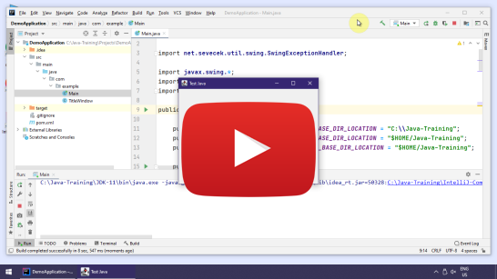
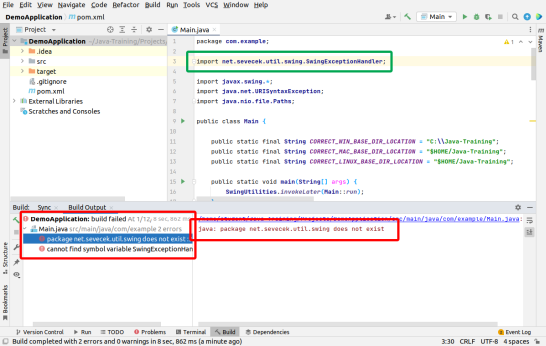

Installation Guide for Windows
==============================

This guide is **only for Windows**.
You can choose macOS or Linux guide [here](../).

Follow the instructions even if you already have some of the software installed
(including `C:\Java-Training`). Existing software will just be updated
and any of your previous projects will not be lost.
The `C:\Java-Training\Projects` folder is not erased.
All other files and subfolders of `C:\Java-Training` will either stay intact
or will be overwritten by a newer version of the software.

Installation
------------

1.  Install **7-Zip**: <https://www.7-zip.org/>

    Watch out! **7-Zip** is much better than **WinRAR** or **WinZip**.
    Install it even if you already have them.
    Especially we noticed **WinRAR** being unable to extract `.7z` correctly.
    We recommend to avoid **WinRAR** and **WinZip** altogether and use exclusively **7-Zip** as it is free and open-source.

2.  Run **7-Zip File Manager** (`7zFM.exe`).

    Click on menu Tools -> Options -> System -> Associate 7-Zip with -> Select all file types (+)

3.  Download the installer of the Java runtime and editor:
    [Java-Training_setup.exe](https://github.com/czechitas/java-install/releases/download/2022-jaro/community/win/Java-Training_setup.exe)

4.  Follow the video guide:

    

5. Try to open and run the Demo project:

    

### Removal of Temporary Files

After the installation is finished, you may optionally remove redundant files in `Downloads` (`Java-Training_setup.exe`) to reclaim some disk space.

    

### Troubleshooting

1.  Problem: Installer `Java-Training_setup.exe` cannot be run because of missing `Run anyway` button or because it is marked as potentially harmful.

    Reason: This may occur when your Windows have too restrictive security settings or your anti-virus software is too suspecting.
    It is especially common when you use a company computer.
    In fact, it is not a real problem. It is only a false positive warning.
    The installer is not digitally signed (because it would cost a lot of money on yearly basis)
    and therefore some antivirus software prevents it from running.
    It does *not* mean that it *really* is harmful.

    Solution: Well done then, do not start the installer.
    Donwload an alternative distribution archive instead:
    [Java-Training.zip](https://github.com/czechitas/java-install/releases/download/2022-jaro/community/win/Java-Training.zip).
    Run **7-Zip** and open `Java-Training.zip` in it.
    Using **7-Zip**, you can extract the files to `C:\Java-Training` manually.
    Target folder is **mandatory**, watch out for the typos.

    Note: If you could not use **7-Zip** (e.g. you do not have admin rights to install new software),
    you should be able to extract the archive using other applications as well.
    Try to prefer **7-Zip** if possible, though, as it is guaranteed to work.

    Follow the video guide:

    

2.  Problem: You open `Documents and Settings` folder (instead of a valid project `DemoApplication`). Also `Maven` tab is missing on the right hand side bar.

    

    Reason: You misclicked in the open dialog and accidentally clicked on a wrong folder to open.

    Solution: In **IntelliJ IDEA**, choose menu **File** -> **Open...** and choose the correct folder. Pay attention to the correct treatment of the open dialog in the regular video guide.

3.  Problem: Maven build failed or the source code remained red.

    

    There may be multiple reasons:
    - You are currently disconnected from the internet.

      Solution: You need to be connected to the internet the entire time. It will be useful during the programming as well.
      Go through the entire installation video guide once more while connected to the internet.

    - VPN (i.e. on a company computer).

      Reason: You may have your Windows set up so that **Maven** should use your company private Java library repository, accessible only via VPN. Such a configuration would be in `C:\Users\YOUR_USERNAME\.m2\settings.xml`.

      Solution: Compilation using **Mavenem** (`clean` and `package`) is necessary to be done with internet connection via VPN. Better stay connected to the internet via VPN the whole time.

    - Prior points are fixed but there is still a problem that **IntelliJ IDEA** displays the code with incorrect color.

      Solution: If red colors remain even after repeated execution of **Maven** goals (`clean` a `package`), you may try somewhat more heavy duty approach:
        - Close **IntelliJ IDEA**
        - Run `C:\Java-Training\Env\RunCmd.bat`
        - A Command line will appear. Write following commands into it (and finish each by pressing [Enter]):
            - `cd ..\Projects\DemoApplication`
            - `mvn clean package exec:java`
        - This time the `It works` window should appear.
        - Start up **IntelliJ IDEA**.
        - Click on Reimport Maven project again.

        You can follow the video guide:

        

4. Maven build was OK, everything in the file `Main.java` is blue / violet,
   especially line 3 in the green box `import net.sevecek.util.SwingExceptionHandler;`
   is blue (as opposed to the red error), but the project still fails to start.

    

   Solution: Restart IntelliJ IDEA. When IntelliJ IDEA restarts, it should already work.
   Perhaps an error in Matrix.

5. If none of the prior worked, will will fix the problem in person before the training.

    

Uninstallation
--------------

The only thing installation in fact does is extract the files to `C:\Java-Training` and spawns a Start menu shortcut for **IntelliJ IDEA**.
To remove the software package, backup your projects in `C:\Java-Training\Projects`, e.g. to `C:\Users\YOUR_USERNAME\Documents`.
Afterwards, just delete the entire `C:\Java-Training`.
Also, delete the **IntelliJ IDEA** shortcut in Start menu. You can find it in `C:\Users\YOUR_USERNAME\AppData\Roaming\Microsoft\Windows\Start Menu\Programs\IntelliJ Community.lnk`.

Almost done.

**Maven** downloads Java libraries to its cache folder in `C:\Users\YOUR_USERNAME\.m2\repository`. Delete it too.
And that is all.

    

Notes for those curious
-----------------------

You will use **Javu** during the training course (namely **AdoptOpenJDK**) and programmer's editor **IntelliJ IDEA** (**Community Edition**).
You **must not** install it from the **official** sources.
Use our bundled archive, which is just extracted to (`C:\Java-Training`) and everything works automatically.
If you installed software from the official sources, you wouldn't have it configured properly for the training.

Note: The software is not really *installed* at all. All files are just extracted from the zip archive (which is bundled inside `Java-Training_setup.exe`).
Software configuration is diverted to `C:\Java-Training\User-Config` and does not use the user profile folder.
therefore it is very much a *portable distribution*.

Note: If you already have a *regular* **JDK** or **IntelliJ IDEA** installed, it is not a problem. We will just *not use it*.
The software from our installation does not interfere with your regular applications.
