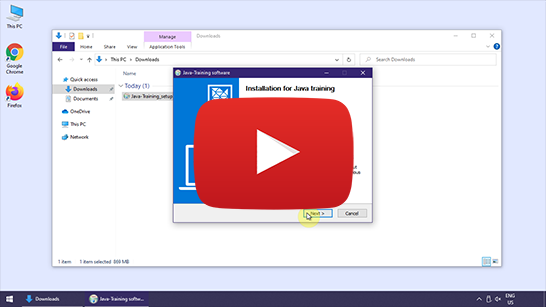
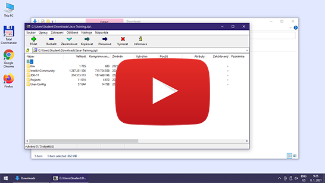
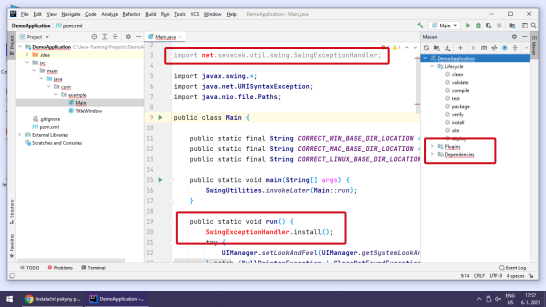

Instalační pokyny pro Windows
=============================

Tyto pokyny jsou **výhradně pro Windows**.
Instalaci pro macOS nebo Linux můžete vybrat [o složku výše](../).

Instrukce následujte i pokud už máte nějaké programy v
`C:\Java-Training` z minula. Žádný strach, původní programy se jen aktualizují
a vaše vlastní projekty zůstanou zachovány.
Projekty máte v `C:\Java-Training\Projects` a tato složka se nemaže.
Ostatní programy v `C:\Java-Training` buď zůstanou nedotčeny
nebo budou přepsány novější verzí programů, což je v pořádku.

Instalace
---------

1.  Nainstalujte si **7-Zip**: <https://www.7-zip.org/>

    Pozor! Nepoužívejte **WinRAR** ani **WinZip**,
    protože ty nedokáží správně rozbalit archívy `.7z`.
    Obecně doporučujeme **WinRAR** i **WinZip** úplně odinstalovat
    a používat výhradně **7-Zip**.
    Je zdarma, open-source a funguje výborně.

2.  Spustťe **7-Zip File Manager** (`7zFM.exe`).

    Klikněte na Tools -> Options -> System -> Associate 7-Zip with -> Zvolte všechny typy souborů (+)

3.  Stáhněte si instalátor javového prostředí a editoru:
    [Java-Training_setup.exe](https://github.com/czechitas/java-install/releases/download/2021-jaro/community/win/Java-Training_setup.exe).

4. Držte se tohoto video návodu:

    

### Úklid dočasných souborů

Po instalaci je nepovinně možno vymazat dočasné soubory v `Downloads` (`Java-Training_setup.exe`), aby nezabíraly místo.

    

### Troubleshooting

1.  Problém: Instalátor `Java-Training_setup.exe` nejde spustit, protože není k dispozici volba `Run anyway` nebo ho antivirus označil za potenciálně nebezpečný.

    Důvod: Tato situace může nastat, pokud máte ve Windows příliš restriktivní bezpečnostní nastavení nebo váš antivirus je příliš podezřívavý.
    Nejčastěji to nastává u služebního počítače.
    Ve skutečnosti jde o nepravé podezření způsobené tím,
    že instalátor není digitálně podepsán (protože by to stálo každý rok dost peněz).
    Digitálně nepodepsaný soubor `.exe` některé antiviry znemožní spustit.

    Řešení: Instalátor tedy nespouštějte.
    Místo toho si stáhněte alternativní distribuční archív:
    [Java-Training.zip](https://github.com/czechitas/java-install/releases/download/2021-jaro/community/win/Java-Training.zip).
    Spusťte **7-Zip** a otevřete `Java-Training.zip` v něm.
    Pomocí **7-Zipu** jde soubory vybalit ručně do `C:\Java-Training`.
    Cílové umístění je **povinné**, pozor na překlepy.

    Poznámka: Pokud byste nemohli mít nainstalovaný **7-Zip**,
    můžete distribuční archív rozbalit i jinou aplikací.
    Nicméně, preferujte **7-Zip**, pokud to jde, protože je zaručené, že funguje správně.

    Více ve video návodu:

    

2.  Problém: Otevřela se složka `Documents and Settings` (nebo kterákoliv jiná složka než `DemoApplication`) a vpravo chybí záložka `Maven`.

    

    Důvod: Nedodrželi jste správný postup práce s otevíracím dialogem a vybrali omylem špatnou složku.

    Řešení: V **IntelliJ IDEA** zvolte v menu **File** -> **Open...** a vyberte správnou složku. Pozorně se věnujte sekci otevírání projektu v základním video návodu.

3.  Problém: Maven build selhal nebo zdrojový text programu zůstal červený.

    

    Důvodů může být víc:
    - Nejste zrovna připojeni na internet.

      Řešení: Celou dobu instalace je nutné mít připojení k internetu. I během programování se vám to určitě bude hodit.
      Spusťte celou instalaci ještě jednou s připojením k internetu.

    - VPN (na firemním počítači).

      Důvod: V systému můžete mít nastaveno, že má **Maven** využívat vaši firemní repository knihoven, přístupnou přes VPN. Bylo by to napsané v konfiguraci v `C:\Users\YOUR_USERNAME\.m2\settings.xml`.

      Řešení: Překlad s **Mavenem** (`clean` a `package`) je třeba provádět s připojením na VPN. Raděj zůstaňte připojeni na VPN po celou dobu i při programování.

    - Předchozí body jsou vyřešeny, ale nepomohlo to. **IntelliJ IDEA** zobrazuje špatně barvy zdrojového textu.

      Řešení: Pokud přetrvává červený text i po opakovaném spuštění mavenových úkolů (`clean` a `package`), můžete zkusit ještě následující silnější kalibr:
        - Zavřete **IntelliJ IDEA**
        - Spusťte soubor `C:\Java-Training\Env\RunCmd.bat`
        - Objeví se příkazová řádka. Postupně do ní napište tyto příkazy (a na konci každé řádky stiskněte [Enter]):
            - `cd ..\Projects\DemoApplication`
            - `mvn clean package exec:java`
        - Tentokrát by se už mělo zobrazit okno `It works`.
        - Znovu zapněte **IntelliJ IDEA**.
        - Stiskněte tlačítko pro Reimport projektu v záložce Mavenu.

        Více ve video návodu:

        

4. Pokud by nic z toho nezabralo, vyřešíme váš problém osobně před kurzem.

    

Odinstalace
-----------

Instalace v podstatě jen rozbalí soubory do `C:\Java-Training` a vytvoří zástupce v nabídce Start.
Pro odstranění tedy nejprve zazálohujte složku `C:\Java-Training\Projects`, ve které máte svoje projekty, například do `C:\Users\YOUR_USERNAME\Documents`.
Potom stačí odstranit celý zbytek `C:\Java-Training`.
Bude fajn se zbavit i zástupce **IntelliJ IDEA** v nabídce Start. Najdete ho v `C:\Users\YOUR_USERNAME\AppData\Roaming\Microsoft\Windows\Start Menu\Programs\IntelliJ Community.lnk`.

Téměř hotovo.

**Maven** si vytváří cache stažených knihoven ve složce `C:\Users\YOUR_USERNAME\.m2\repository`, takže tu také smažte.
A to už je všechno.

    

Poznámky pro zvídavé
--------------------

Na kurzu budete používat **Javu** (distribuci **AdoptOpenJDK**) a programátorský editor **IntelliJ IDEA** (**Community Edition**).
**Nesmíte** si je ale nainstalovat z **oficiální** distribuce.
Místo toho se použije přednastavený archív, který se jen rozbalí do povinného umístění (`C:\Java-Training`) a vše bude fungovat.
Kdybyste si nainstalovali software z oficiální distribuce, neměli byste ho správně nakonfigurovaný pro školení.

Poznámka: Nic se doopravdy neinstaluje, všechno se jen rozbalí ze zipu (který je součástí `Java-Training_setup.exe`).
Konfigurace softwaru je převedena do složky `C:\Java-Training\User-Config` a nikoliv v uživatelském profilu.
Jde tedy vlastně o *portable distribuci*.

Poznámka: Pokud už máte nainstalované *vlastní* **JDK** nebo **IntelliJ IDEA**, nevadí to, ale na kurzu je používat *nebudeme*.
Výukový software z naší instalace nijak neovlivní vaše už nainstalované aplikace.
Pokud byste ale instalaci neprovedli, nešly by vám spouštět ukázkové příklady.
