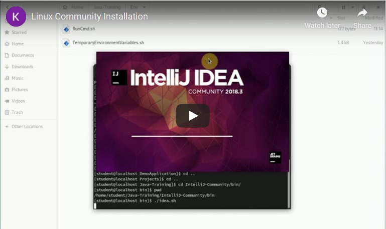

Instalační pokyny pro Linux
===========================

Tyto pokyny jsou **výhradně pro Linux**.
Instalaci pro macOS nebo Windows můžete vybrat [o složku výše](../).

Pokud už jste instalaci na Java kurz někdy prováděly,
nejspíš máte v `/home/VASE_UZIVATELSKE_JMENO/Java-Training/Projects`
projekty z minula. Žádný strach, instalační skript nic nemaže.

Pokud by kterýkoliv program,
který si nainstalujete v rámci této instalace,
nabízel update, prosím odmítněte to.
Programy jsou přesně vybrané, aby spolu fungovaly, a jsou předkonfigurované.
Updatované verze by ztratily konfiguraci a materiály z kurzu by nešly spustit.

<a id="detailni">Detailní postup:</a>
-------------------------------------

1. Archív s instalací si stáhněte zde: [Java-Training.tar.gz](https://github.com/czechitas/java-install/releases/download/2021-jaro/community/linux/Java-Training.zip)

2. Držte se tohoto video návodu:

    

3. Po instalaci si můžete uklidit složku Downloads.
