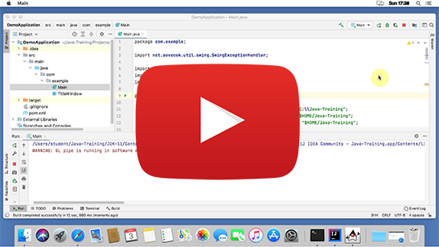

Installation guide for macOS
============================

This guide is **only for macOS**.
You can choose Windows or Linux guide [here](../).

Follow the instructions even if you already have some of the software installed
(including `/Users/YOUR_USERNAME/Java-Training`). You will not lose any previous `Projects` because this folder is not being erased.
Although, you might want to backup `/Users/YOUR_USERNAME/Java-Training` to e.g. `Documents` folder temporarily.
All other files and subfolders of `/Users/YOUR_USERNAME/Java-Training` will either stay intact or will be overwritten by a newer version of the software.

<a id="detailni">Detail guide:</a>
-------------------------------------

1. Download the installation archive: [Java-Training.zip](https://github.com/czechitas/java-install/releases/download/2021-jaro/community/mac/Java-Training.zip)

2. Follow the video guide:

    

3. You can optionally clean up the Downloads folder:

    
