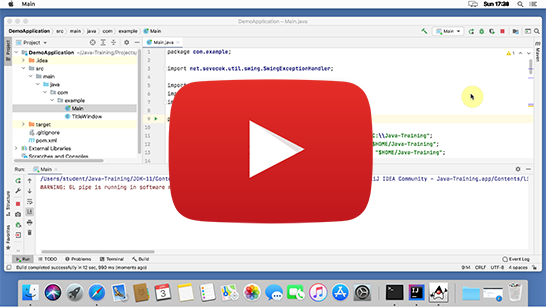

Instalační pokyny pro macOS
===========================

Tyto pokyny jsou **výhradně pro macOS**.
Instalaci pro Windows nebo Linux můžete vybrat [o složku výše](../).

Pokud už jste instalaci na Java kurz někdy prováděly,
nejspíš máte v `/Users/VASE_UZIVATELSKE_JMENO/Java-Training/Projects`
projekty z minula. Doporučujeme vám je zazálohovat zkopírováním například do `Dokumenty` ve vašem uživatelském profilu
a po dokončení instalace je přesunout zpět do složky
`/Users/VASE_UZIVATELSKE_JMENO/Java-Training/Projects`.

Pokud by kterýkoliv program,
který si nainstalujete v rámci této instalace,
nabízel update, prosím odmítněte to.
Programy jsou přesně vybrané, aby spolu fungovaly, a jsou předkonfigurované.
Updatované verze by ztratily konfiguraci a materiály z kurzu by nešly spustit.

Postup:
------

1. Archív s instalací si stáhněte zde: [Java-Training.zip](https://github.com/czechitas/java-install/releases/download/2021-jaro/community/mac/Java-Training.zip)

2. Držte se tohoto video návodu:

    

### Troubleshooting

1.  Maven build selhal nebo zůstal zdrojový text programu červený.

    Důvod: Důvodů může být víc:
    - Nejste zrovna připojeni na internet

      Řešení: Celou dobu instalace je nutné mít připojení k internetu. I během programování se vám to určitě bude hodit.

    - VPN

      Řešení: Můžete mít v systému nastaveno, že má Maven využívat vaši firemní repository knihoven, přístupnou přes VPN. Potom je potřeba krok s Mavenem (clean a package) provést s připojením na VPN. Raděj zůstaňte připojeni na VPN po celou dobu i při programování.

    - IntelliJ IDEA zobrazuje špatně barvy zdrojového textu

      Řešení: Pokud přetrvává červený text i po opakovaném spuštění mavenových úkolů (clean a package), můžete zkusit ještě následující silnější kalibr:
        - Zavřete IntelliJ IDEA
        - Spusťte soubor $HOME/Java-Training/Env/RunCmd.command v terminálu (Open with -> Terminal)
        - Objeví se příkazová řádka. Postupně do ní napište tyto příkazy (a na konci každé řádky stiskněte [Enter]):
            - `cd $HOME/Java-Training/Projects/DemoApplication`
            - `mvn clean package exec:java`
        - Tentokrát by se už mělo zobrazit okno `It works`.
        - Znovu zapněte IntelliJ IDEA
        - Stiskněte tlačítko pro reimport projektu.

        Více ve video návodu:

        

2. Pokud by nic z toho nezabralo, vyřešíme váš problém osobně před kurzem.

### Úklid dočasných souborů

Po instalaci je nepovinně možno vymazat dočasné soubory v Downloads (Java-Training), aby nezabíraly místo.

### A to je vše. Tešíme se na vás na akci.
