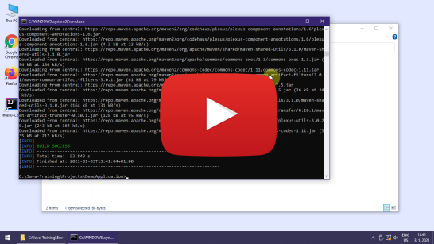

Instalační pokyny pro Windows
=============================

Tyto pokyny jsou **výhradně pro Windows**.
Instalaci pro macOS nebo Linux můžete vybrat [o složku výše](../).

Tyto instrukce následujte i pokud už máte nějaké programy v
`C:\Java-Training` z minula. Žádný strach, původní programy se jen aktualizují a vaše vlastní projekty zůstanou zachovány.
Projekty máte v `C:\Java-Training\Projects` a tato složka se nemaže.
Ostatní programy v `C:\Java-Training` buď zůstanou nedotčeny
nebo budou přepsány novější verzí programů, což je v pořádku.

Zkušení uživatelé mohou přeskočit ke [krátkému popisu](advanced.html),
ale doporučujeme to nedělat a držet se tohoto obrázkového návodu.

Postup:
------

1.  Nainstalujte si **7-Zip**: <https://www.7-zip.org/>

    To platí i v případě, že už máte **WinRAR** nebo **WinZip**.
    Především **WinRAR** nedokáže soubory `.7z` správně rozbalit.
    Obecně doporučujeme **WinRAR** nebo **WinZip** úplně odinstalovat
    a používat výhradně **7-Zip**.
    Je zdarma, open-source a funguje výborně.

2.  Spustťe **7-Zip File Manager**.

    Klikněte na Tools -> Options -> System -> Associate 7-Zip with -> Zvolte všechny typy souborů (+)

3.  Stáhněte si instalátor javového prostředí a editoru:
    [Java-Training_setup.exe](https://github.com/czechitas/java-install/releases/download/2021-jaro/community/win/Java-Training_setup.exe)

4. Držte se tohoto video návodu:

    

### Troubleshooting

1.  Instalátor `Java-Training_setup.exe` nejde spustit, protože není k dispozici volba `Run anyway`.

    Důvod: To může nastat, pokud máte ve Windows příliš restriktivní bezpečnostní nastavení.
    Například u pracovního počítače.

    Řešení: Spusťte 7-Zip a otevřete Java-Training_setup.exe v něm.
    Pomocí 7-Zipu jde všechny soubory vybalit ručně do `C:\Java-Training` (cílové umístění je **povinné**).

    Více ve video návodu:

    

2.  Maven build selhal nebo zůstal zdrojový text programu červený.

    Důvod: Důvodů může být víc:
    - Nejste zrovna připojeni na internet

      Řešení: Celou dobu instalace je nutné mít připojení k internetu. I během programování se vám to určitě bude hodit.

    - VPN

      Řešení: Můžete mít v systému nastaveno, že má Maven využívat vaši firemní repository knihoven, přístupnou přes VPN. Potom je potřeba krok s Mavenem (clean a package) provést s připojením na VPN. Raděj zůstaňte připojeni na VPN po celou dobu i při programování.

    - IntelliJ IDEA je zmatená

      Řešení: Pokud přetrvává červený text i po opakovaném spuštění mavenových úkolů (clean a package), můžete zkusit ještě následující silnější kalibr:
        - Zavřete IntelliJ IDEA
        - Spusťte soubor C:\Java-Training\Env\RunCmd.bat
        - Objeví se příkazová řádka. Postupně do ní napište tyto příkazy (a na konci každé řádky stiskněte [Enter]):
            - `cd ..\Projects\DemoApplication`
            - `mvn clean package exec:java`
        - Tentokrát by se už mělo zobrazit okno `It works`.
        - Znovu zapněte IntelliJ IDEA
        - Stiskněte tlačítko pro reimport projektu.

        Více ve video návodu:

        

3. Pokud by nic z toho nezabralo, vyřešíme váš problém osobně před kurzem.

### Úklid dočasných souborů

Po instalaci je nepovinně možno vymazat dočasné soubory v Downloads (Java-Training_setup.exe), aby nezabíraly místo.

### A to je vše. Tešíme se na vás na akci.
