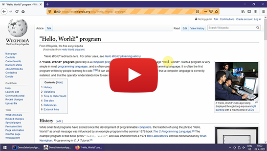
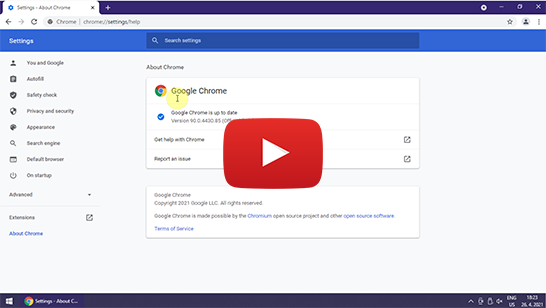

Instalační pokyny pro automatizované testy pomocí knihovny Selenium
===================================================================

Knihovna Selenium slouží pro řízení prohlížeče pomocí vámi napsaného programu.
Lze tak psát automatizované testy webových stránek.
My budeme vytvářet programy v Javě, nicméně, lze je spát i v mnoha dalších jazycích.
Knihovna Selenium vyžaduje, abyste měli na počítači nainstalovaný zvolený prohlížeč
a k němu odpovídající ovladač (Web Driver).

My budeme používat Firefox (kódovým označením Gecko [Gekou]),
proto budeme potřebovat i ovladač GeckoDriver.
Selenium podporuje i Chrome a další prohlížeče. Hlavní prohlížeč v kurzu bude ale Firefox,
protože se jeho Selenium *Driver* nemění každý měsíc (narozdíl od Chromu)
a protože je vhodné používat pro spouštení seleniových testů jiný prohlížeč
než váš běžný.

Instalace
---------

1.  Stáhněte a nainstalujte si Firefox.

2.  Stáhněte si nejnovější [GeckoDriver](https://github.com/mozilla/geckodriver/releases/).

    Například pro Windows jsem použil `geckodriver-v0.29.1-win64.zip`,
    pro macOS `geckodriver-v0.29.1-macos.tar.gz`,
    pro macOS na Macu M1 `geckodriver-v0.29.1-macos-aarch64.tar.gz`.

    Na Windows rozbalte GeckoDriver do `C:\Java-Training\Selenium`.
    Budete tak mít soubor `C:\Java-Training\Selenium\geckodriver.exe`.

    Na macOS nebo Linuxu rozbalte GeckoDriver do `/Users/VASE_UZIVATELSKE_JMENO/Java-Training/Selenium`.
    Budete tak mít soubor `/Users/VASE_UZIVATELSKE_JMENO/Java-Training/Selenium/geckodriver`.

3.  Stáhněte si testovací demo [aplikaci](Java-Training--Projects.zip).

    Archív s aplikací rozbalte do `C:\Java-Training\Projects` na Windows
    nebo `/Users/VASE_UZIVATELSKE_JMENO/Java-Training/Projects` na macOS nebo Linuxu.

4.  Otevřete testovací aplikaci `DemoSeleniumApplication` v IntelliJ IDEA
    a počkejte, až se celý projekt načte
    a zmizí tím pádem ukazatel postupu na spodní liště IntelliJ IDEA.

5.  Pro jistotu si ještě vyžádejte občerstvení mavenové konfigurace projektu.

    V IntelliJ IDEA na pravé liště je tlačítko Maven. Rozbalí vám rám Mavenu.
    Klikněte na tlačítko *Reload All Maven Projects*.
    Až se vše provede, rozbalte v rámu Mavenu ještě DemoSeleniumApplication -> Lifecycle -> `package`.
    Dvojklikem vyvolejte `package`.

6.  Demo aplikaci klasicky spusťte.

    Pokud vše proběhne s výsledným hlášením `It worked fine!`, máte hotovo.
    V případě chyby se ji buď pokuste sami vyřešit nebo se ozvěte.

    Poznámka: Chybová hláška níže, která se objevuje v konzoli, je v pořádku. Nejedná se o problém. Nemá to vliv na funkci.

    ~~~~
    ###!!! [Parent][RunMessage] Error: Channel closing: too late to send/recv, message will be lost
    ~~~~

7.  Správný postup si můžete zkontrolovat na videu:

    

    

Poznámky pro skalní zastánce Chromu
-----------------------------------

Pokud trváte na použití Chromu, jde to. Stáhněte si do složky `C:\Java-Training\Selenium`
[Chrome Driver](https://chromedriver.storage.googleapis.com/index.html).
Verze musí být stejná, jako verze vašeho prohlížeče. Tu zjistíte v Chrome -> Menu -> Help -> About Google Chrome.
V době psaní to byla verze **90.0.4430.24**. 
Na Windows tak budete mít soubor `C:\Java-Training\Selenium\chromedriver.exe`. 
Na macOS nebo Linuxu to bude soubor `/Users/VASE_UZIVATELSKE_JMENO/Java-Training/Selenium/chromedriver`.

V demo aplikaci v souboru `Main.java` na řádku 46 změňte:

~~~~java
openBrowser(FIREFOX);
~~~~

na:

~~~~java
openBrowser(CHROME);
~~~~

Pozor! Chrome driver má nevýhodu, že při každém updatu Chromu je nutné přeinstalovat i driver.
Nové verze Chromu vycházejí zhruba v měsíčních intervalech, je tedy poměrně nešikovné
neustále updatovat `chromedriver.exe`.

Vzhledem k drtivé převaze Chromu mezi uživateli, předpokládám, že na běžné brouzdání používáte právě Chrome.
Obecně je vhodné pro Selenium nepoužívat prohlížeč, který běžně používáte pro osobní brouzdání po internetu.
Pokud budete používat stejný prohlížeč pro osobní brouzdání i Selenium,
nezřídka se stane, že omylem místo Seleniem otevřeného prohlížeče zavřete okno s osobními stránkami.
Byli jste varováni.

Správný postup si můžete zkontrolovat na videu:

